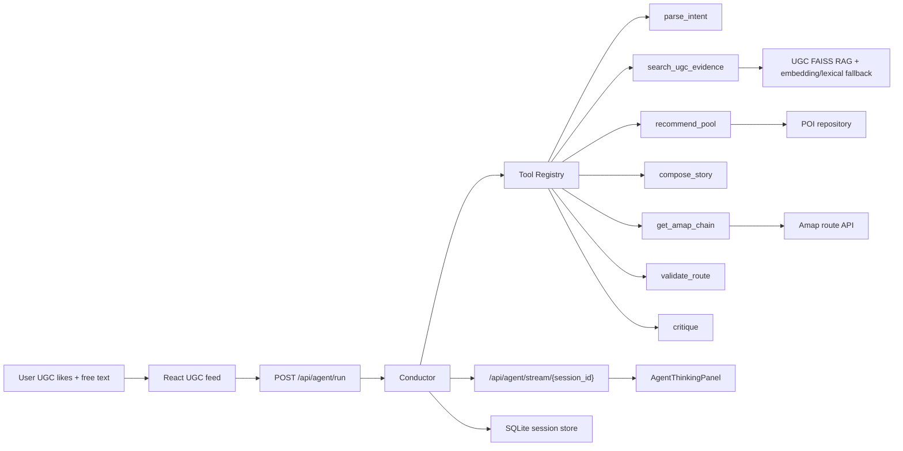

# AIroute - Multi-Agent Local Route Planner

[Design Doc](docs/agent_development_plan.md) · [Finalization Plan](docs/agent_finalization_plan.md) · [Architecture](docs/agent_architecture.md)

AIroute 是一个面向本地即时出行的路线规划 agent：Conductor 主控调度 9 个工具，结合 UGC RAG、候选池推荐、高德真实路线、StoryAgent 叙事编排、Critic 校验和反馈修复，把“想吃本地菜、少排队、顺路拍照”这类自然语言需求变成可解释、可调整、可回放的路线。

## Architecture



## Tech Stack

FastAPI · Pydantic · React · TypeScript · Vite · Zustand · SQLite · FAISS · numpy · BGE-small-zh embedding · LongCat/OpenAI-compatible LLM · Amap Web Service

## Quick Start

```powershell
cd backend
pip install -e .[dev]
cd ..
python scripts/embed_ugc.py
python -m uvicorn app.main:app --app-dir backend --reload --port 8000
```

```powershell
cd frontend
npm install
npm run dev
```

Open http://127.0.0.1:5173, like a few UGC cards, then generate an instant route.

## Configuration

```powershell
AMAP_WEB_SERVICE_KEY=your_amap_web_service_key
LLM_PROVIDER=longcat
LLM_BASE_URL=https://api.longcat.ai/v1
LLM_MODEL=longcat-max
LLM_API_KEY=your_llm_key
AGENT_TOOL_CALLING_ENABLED=true
```

Frontend map keys:

```powershell
VITE_AMAP_JS_KEY=your_amap_js_key
VITE_AMAP_SECURITY_JS_CODE=your_amap_security_js_code
VITE_API_BASE_URL=http://127.0.0.1:8000/api
```

## Verify

```powershell
curl http://127.0.0.1:8000/api/agent/tools
curl http://127.0.0.1:8000/api/agent/stream/{session_id}
python scripts/replay_trace.py {session_id}
cd backend
pytest -q
pytest tests/test_agent_eval.py -q
cd ../frontend
npm test
npm run build
```

## Core Endpoints

- `POST /api/agent/run`
- `POST /api/agent/adjust`
- `GET /api/agent/trace/{session_id}`
- `GET /api/agent/stream/{session_id}`
- `GET /api/agent/tools`
- `POST /api/route/chain`
- `GET /api/ugc/feed`

Design details are in [docs/agent_development_plan.md](docs/agent_development_plan.md) and [docs/agent_finalization_plan.md](docs/agent_finalization_plan.md).
