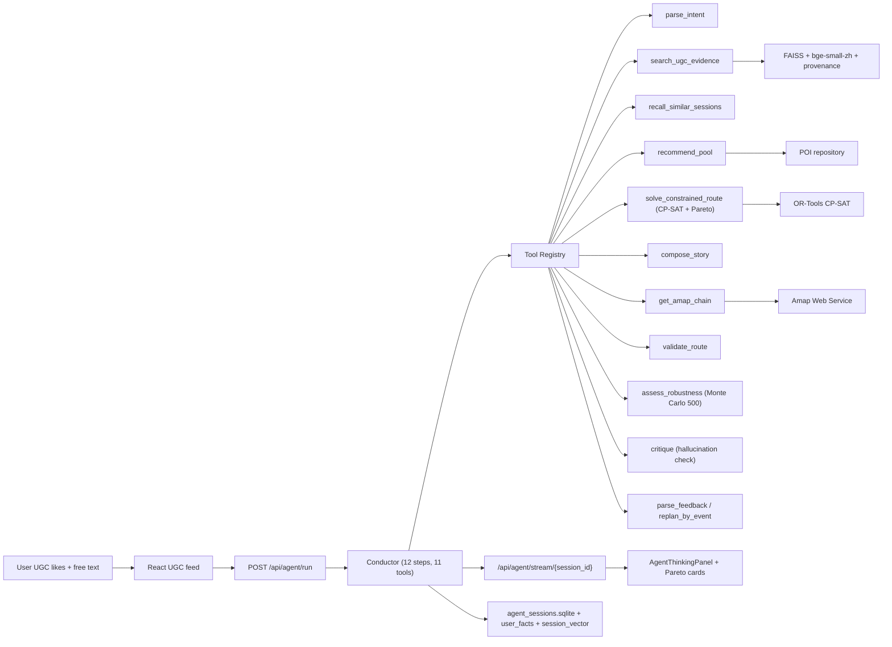

# AIroute · 本地路线智能规划系统

> 输入一句自然语言，输出 5 条带 Pareto 权衡、UGC 证据、蒙特卡洛准时概率的本地一日路线。
> 在 5 个基准场景上 **硬约束满足率 100% / 解释忠实度 1.0 / 与最优解 gap 0.001 / Ranker NDCG +95%**，全流程指标可一键复现、CI 可拦回归。

[技术评审版总结](docs/项目总结-技术评审版.md) · [业务 Demo 评测](docs/business-demo-eval.md) · [改造方案](docs/AIroute-改造方案.md) · [响应延迟分析](docs/响应延迟优化与待补数据.md) · [开发计划](docs/agent_development_plan.md) · [架构详解](docs/current-architecture.md)

---

## 系统能做什么

把"今天下午想少排队、吃本地菜、顺路拍照"这类自然语言诉求，变成可解释、可调整、可回放的本地路线。架构分四层，每层各司其职、有指标、有降级：

| 层 | 负责 | 实现 |
| --- | --- | --- |
| **LLM 编排（决策）** | "下一步该调哪个工具" | OpenAI 兼容 function calling + 工具白名单 + 规则路径兜底 |
| **运筹（路线）** | 时间窗内最大化效用 | OPTW（带时间窗的定向越野）· OR-Tools CP-SAT + 精确枚举 + 贪心三档 |
| **机器学习（排序）** | POI 相关性打分 | LightGBM LambdaMART + 训练/serve 同源 + 缺模型自动降级 |
| **评测（守门）** | 证明效果 | 5 场景 × 6 指标 + 与最优解 gap + 解释忠实度自动化 + CI gate |

LLM 只决策不生成、运筹给最优解、ML 给排序质量、评测兜住回归——这是本项目和"LLM 直接吐 JSON"路线规划的本质区别。

---

## Architecture



---

## 关键指标（一键复现）

数据来自 `python -m eval.run_eval --enforce-gate` 与 `python scripts/bench_latency.py --modes rule --repeats 20`。

### 质量

| 指标 | 值 | gate |
| --- | ---: | --- |
| 场景覆盖 | 5（半日吃饭 / 预算紧 / 必去景点 / 少排队 / 家庭雨天） | — |
| 硬约束满足率 | **100%** | ≥ 90% ✅ |
| 解释忠实度 | **1.000** | ≥ 90% ✅ |
| 路线相对 CP-SAT 精确解 gap | **0.001–0.002** | ≤ 0.5 ✅ |
| Pareto 变体数 / 场景 | **5** 条非支配解 | ≥ 3 ✅ |
| Pareto 平均 POI overlap | `avg_variant_jaccard_overlap` | 越低代表方案差异越大 |
| 路线品类熵 | `avg_category_entropy` | 衡量是否过度固定模板 |
| 场景业务预期通过率 | `scenario_expectation_pass_rate` | 雨天室内 / 少排队 / 预算紧等 |
| 蒙特卡洛准时概率（500 次模拟） | **0.951** | — |
| Ranker NDCG@5（vs 规则基线） | **0.4725 vs 0.2422 = +95.1%** | ≥ +3% ✅ |
| **CI gate** | **PASS** | |

### 性能（rule 模式 / repeats=20）

| 指标 | 值 | advisory |
| --- | ---: | --- |
| Warm p95 | ~4290 ms | ≤ 4500 ms ✅ |
| Max cold | ~4125 ms | ≤ warm p95 × 3 ✅ |
| `solve_constrained_route` warm mean | ~1150 ms | — |
| `recommend_pool` warm mean | ~600 ms | — |
| 其它 9 个工具合计 | < 100 ms | — |

完整方法学、阈值演变史见 [`docs/响应速度测试设计.md`](docs/响应速度测试设计.md) 与 [`docs/响应延迟优化与待补数据.md`](docs/响应延迟优化与待补数据.md)。

### 业务 Demo 验收

工程指标用于防回归，不等同于真实线上业务效果。`constraint_satisfaction_rate=1.0` 只说明路线通过合法性校验，不代表业务路线足够丰富。合肥 Demo 另按 [`docs/business-demo-eval.md`](docs/business-demo-eval.md) 验收：演示 UGC 覆盖、天气影响、反馈调整、Pareto 方案切换、方案多样性、无高德 Key 文字路线降级和推荐理由证据率。

---

## 核心技术亮点

**① Plan-Act-Observe Agent Harness** · `backend/app/agent/conductor.py`
12 步预算 · 11 工具白名单 · LLM tool-calling + 规则路径双模式 · Critic 含**幻觉检查**（`hallucinated_poi` / `hallucinated_ugc`），失败可触发一次路线压缩或重组。

**② OPTW + CP-SAT 三档求解** · `backend/app/solver/optw.py`
形式化为带时间窗的定向越野：在时间预算 + 营业时间 + 预算 + must-visit + 类目组（OR 关系）下最大化 Σutility。CP-SAT（默认）→ 精确枚举（候选 ≤ 8，作 oracle）→ 贪心 fallback（不可行时给"尽力而为"+ violations 标注）。

**③ 多目标 Pareto 前沿** · `backend/app/solver/pareto.py`
5 个权重 profile（`interest / balanced / time_saving / budget_saving / low_queue`）通过 `ThreadPoolExecutor` 并行 → 4 维支配判定 → 非支配过滤。前端 `AmapRoutePage` 渲染卡片切换，tradeoff 文案由指标差自动生成。

**④ Learning-to-Rank · train/serve 同源** · `backend/app/ml/ranker.py` + `scripts/train_ranker.py`
训练直接调用线上 `PoiScoringService.score_poi(...)` 产 breakdown 当特征，根除 train/serve skew；合成多 query 分组让 lambdarank 真做 listwise。NDCG@5 = 0.4725 vs 规则 0.2422（**+95.1%**）。

**⑤ 蒙特卡洛鲁棒性** · `backend/app/sim/montecarlo.py`
对最终路线做 500 次随机采样（每站停留/排队/段间通行时间高斯扰动），输出 `on_time_prob / expected_overflow_min / p90_total_min`。Conductor 在 `validate_route` 后自动跑，前端徽标显示"准时 95%"。

**⑥ 三层记忆 + 跨会话情景召回** · `backend/app/agent/store.py` + `user_memory.py`
`agent_sessions` SQLite 按 `user_id` 隔离 · `user_facts` 长期偏好（喜欢的类目/区域/预算区间/被拒 POI）· `session_vector_repo` 把会话主诉求向量化，下次进来 `recall_similar_sessions` 找语义相近历史。

**⑦ 全栈可观测** · `backend/app/observability/`
structlog 结构化日志 + Prometheus 指标（`TOOL_LATENCY` / `AGENT_RUN_LATENCY` / `MEMORY_LAYER_USAGE` / 缓存命中 / 幻觉计数）+ OpenTelemetry span（每工具一个）+ `session_cost_summary` 按会话核 token / 延迟 / 估算 USD。

**⑧ "无 key 也能跑"的降级哲学** · 全栈 6 处确定性 fallback
LLM 无 key → 规则；CP-SAT 无解 → 贪心；Ranker 缺模型 → 规则总分；高德无 key → haversine + 速度估计；FAISS 无 index → 关键字 + 池子兜底；Monte Carlo 失败 → 跳过不阻塞。

---

## Quick Start

### 准备

```powershell
# 进入仓库根目录；如果还没拉代码，先 clone/download 后进入 AIroute 目录
cd <repo-root>

# 后端
python -m venv .venv
.\.venv\Scripts\Activate.ps1
cd backend
pip install -e .[dev]
cd ..

# 一次性数据
python scripts\import_hefei_pois.py     # POI sqlite
$env:AIROUTE_REAL_DATA_DIR = Join-Path (Get-Location) 'data\processed'
python scripts\build_faiss_rag.py --city hefei --sqlite-path "$env:AIROUTE_REAL_DATA_DIR\hefei_pois.sqlite" --require-real-data --index-dir data\faiss
python scripts\embed_ugc.py             # UGC FAISS embedding
python scripts\train_ranker.py          # LambdaMART ranker（达标后自动启用）

# 前端
cd frontend
npm install   # 或 pnpm install
cd ..
```

### 跑起来

```powershell
# 后端（会执行 lifespan startup warmup，~30 s）
python -m uvicorn app.main:app --app-dir backend --reload --port 8000

# 前端
cd frontend
npm run dev   # 或 pnpm dev
```

打开 `http://127.0.0.1:5173` → 收藏 UGC → 生成即时路线，看到 5 条 Pareto 方案 + 准时概率徽标 + 可解释理由。

`/health` 应显示 `rag.status=ready`、`faiss.document_count > 0`、`amap.status=ready`（配了 Amap key 的情况下）。无 Amap key 时路线生成自动回退到 haversine + 速度估计。

### 跑评测 / bench

```powershell
# 5 场景质量评测（带 CI gate）
python -m eval.run_eval --out data\eval\route_eval.md --enforce-gate

# 延迟基准（rule, repeats=20 ≈ 8 分钟）
python scripts\bench_latency.py --modes rule --repeats 20 --out data\eval\latency_report_20rep.md

# 后端单测（30+ 项）
cd backend
pytest -q
mypy app/
cd ..

# 前端
cd frontend
npm test
npm run build
```

### Demo 数据预热

```powershell
python scripts\generate_demo_ugc.py       # 生成合肥演示 UGC JSONL（不抓取外部平台）
python scripts\warmup_demo_sessions.py    # 为 demo_user 灌一些历史会话，方便演示跨会话记忆
```

---

## Configuration

```powershell
# LLM（OpenAI 兼容，支持 LongCat / DeepSeek 等）
LLM_PROVIDER=longcat
LLM_BASE_URL=https://api.longcat.ai/v1
LLM_MODEL=longcat-max
LLM_API_KEY=your_llm_key
AGENT_TOOL_CALLING_ENABLED=true
AGENT_FAST_DECISION_ENABLED=true          # 默认走规则快路径；设 false 启用 LLM 自主决策

# 高德地图
AMAP_WEB_SERVICE_KEY=your_amap_web_service_key
AMAP_KEY=optional_fallback_amap_key

# RAG
FAISS_INDEX_PATH=data/faiss
EMBEDDING_MODEL=BAAI/bge-small-zh-v1.5

# Ranker
RANKER_ENABLED=true
RANKER_MODEL_PATH=data/models/ranker.txt  # train_ranker.py 产出，缺失自动降级

# 启动 warmup（默认 true；单测/CI 可关）
STARTUP_WARMUP_ENABLED=true
STARTUP_WARMUP_QUERY=warmup

# 可观测
LOG_LEVEL=INFO
OTEL_SERVICE_NAME=airoute-agent
OTEL_EXPORTER_OTLP_ENDPOINT=http://127.0.0.1:4317
```

前端 map keys：

```powershell
VITE_AMAP_JS_KEY=your_amap_js_key
VITE_AMAP_SECURITY_JS_CODE=your_amap_security_js_code
VITE_API_BASE_URL=http://127.0.0.1:8000/api
```

发现页 (DiscoveryFeed) 会带 `origin_latitude` / `origin_longitude` / `radius_meters` 给 pool 和 agent 接口，并同步写到 `need_profile.destination`。合肥请求若不带起点，后端回退到 demo Hefei 中心点。后端响应里带 `distance_meters`、retrieval provenance、evidence snippets，前端路线卡片可直接渲染。

---

## Observability

后端日志走 structlog，每条日志带 `session_id` / `trace_id` / `user_id` / `goal_kind` 上下文。Prometheus 指标 `/metrics`，包括：

- `agent_run_latency` · `tool_latency`（按 tool_name 分组）
- LLM token 计数 · Amap 请求计数
- 幻觉计数 · 缓存命中率 · 三层记忆命中率（`MEMORY_LAYER_USAGE{layer=episodic|semantic|vector}`）

按会话核成本：

```powershell
curl http://127.0.0.1:8000/api/agent/cost/{session_id}
```

OpenTelemetry 默认关闭。本地看 trace：

```powershell
docker run --rm -p 16686:16686 -p 4317:4317 jaegertracing/all-in-one:latest
$env:OTEL_EXPORTER_OTLP_ENDPOINT='http://127.0.0.1:4317'
python -m uvicorn app.main:app --app-dir backend --reload --port 8000
```

Jaeger UI 在 http://127.0.0.1:16686。

---

## Cache Strategy

AIroute 默认走本地缓存，不需要 Redis：

- **Amap 路线腿**持久化在 `data/processed/amap_cache.sqlite`，同 origin/destination/mode 不重复打高德。
- **LLM 工具决策**响应在内存 LRU 缓存 5 分钟（仅缓存成功结果，fallback 不缓存）。
- **BGE query embedding** 500 条 LRU 进程共享，UGC 检索和相似会话检索共用。
- **OPTW 解**（OPT-3 计划项，待实施）。
- 缓存命中/未命中通过 `agent_cache_hits_total` 暴露；Amap 命中状态见 `agent_amap_requests_total`。

检查 Amap 缓存：

```powershell
sqlite3 data/processed/amap_cache.sqlite "SELECT COUNT(*), AVG(hit_count) FROM amap_segments"
```

---

## Quality Gates

- **Prompts 版本化**：`backend/app/agent/prompts` 下每个 prompt 都有版本号，story 运行时把 `prompt:story@v1.0.0` 写进 tool call 和 trace 事件。
- **离线评测 gate**（CI 拦回归）：

```powershell
cd backend
python -m eval.run_eval --enforce-gate
pytest tests/test_quality_engineering.py tests/test_agent_snapshots.py -q
mypy app/
```

- **API 响应快照**只在 schema 故意变更时刷新：

```powershell
pytest tests/test_agent_snapshots.py --snapshot-update
```

- **LLM 质量回归**（消耗 token，默认跳过）：

```powershell
$env:RUN_LLM_EVAL='1'
pytest tests/test_prompt_regression.py -q

$env:RUN_LLM_JUDGE='1'
$env:JUDGE_LLM_API_KEY='your_judge_key'
pytest tests/test_agent_quality.py -q
```

- **GitHub Actions** PR 触发：`.github/workflows/eval.yml` 跑 `eval.run_eval --enforce-gate`，gate 红即 PR 红。

---

## 项目结构

```
AIroute/
├── backend/
│   └── app/
│       ├── agent/           Conductor + tools(11) + specialists (Critic / StoryAgent / RepairAgent)
│       ├── api/             FastAPI 路由（/api/agent/run, /pool, /trips, /preferences, ...）
│       ├── llm/             OpenAI 兼容 client + cache + telemetry
│       ├── ml/              ranker.py + features.py（LightGBM LambdaMART）
│       ├── observability/   structlog + Prometheus + OpenTelemetry
│       ├── repositories/    poi_repo (SQLite) + faiss_index + session_vector_repo + amap_cache
│       ├── schemas/         pydantic 数据契约
│       ├── services/        plan / pool / chat / retrieval / route_validator / amap / ...
│       ├── sim/             montecarlo.py（500 次模拟鲁棒性）
│       ├── solver/          optw.py (CP-SAT) + pareto.py + distance.py + amap_client
│       └── config.py        pydantic-settings
│   ├── eval/                场景 YAML + metrics + run_eval + gate
│   └── tests/               30+ 项：OPTW / Pareto / MC / Ranker / Agent / Memory / Amap
├── frontend/                React 18 + Vite + TS + Zustand（移动优先）
│   └── src/pages/AmapRoutePage.tsx   最终落地页（Pareto 卡片 + 鲁棒性徽标）
├── scripts/                 import_hefei_pois / embed_ugc / build_faiss_rag /
│                            train_ranker / bench_latency / warmup_demo_sessions / ...
├── skills/                  6 份 agent 设计文档（route-planning / replan / trip-manager / ...）
├── data/
│   ├── processed/           hefei_pois.sqlite / agent_sessions.sqlite / ugc_hefei.faiss / amap_cache.sqlite
│   ├── models/              ranker.txt（训练产出）
│   └── eval/                route_eval.md / ranker_train.json / latency_report*.md
├── docs/                    详细文档（见下表）
└── .github/workflows/eval.yml   PR 触发的质量 gate
```

---

## 文档索引

### 总览与汇报

| 文档 | 适合谁 |
| --- | --- |
| [项目总结·技术评审版](docs/项目总结-技术评审版.md) | 黑客松评委 / 技术 reviewer — 创新点 + 架构 + 算法深度 + 实测指标 + 论文对应 |
| [项目总结·简历素材版](docs/项目总结-简历素材版.md) | 个人简历 / 面试 — STAR 叙事 + TL;DR 指标 + 5 个面试 talking points |
| [当前架构详解](docs/current-architecture.md) | 想看完整模块切分与数据流的人 |
| [开发计划](docs/agent_development_plan.md) | 历史设计上下文 |
| [产品开发计划](docs/product-development-plan.md) | 产品视角的功能列表 |

### 改造与优化

| 文档 | 内容 |
| --- | --- |
| [AIroute 改造方案](docs/AIroute-改造方案.md) | 初版 10 工作项设计（M1–M4 里程碑 + 工作量估算） |
| [未完成项·修改方案](docs/未完成项-修改方案.md) | WP-3/5/6/9 收尾详细代码骨架 |
| [响应速度测试设计](docs/响应速度测试设计.md) | bench_latency.py 的方法学、变量矩阵、阈值定义 |
| [响应延迟优化与待补数据](docs/响应延迟优化与待补数据.md) | 6 项优化 / 6 项数据缺口；含 OPT-1/2/5 实测落地记录 |

### 历史 / 长期记忆

| 文档 | 内容 |
| --- | --- |
| [Agent 记忆开发计划](docs/agent_memory_plan.md) | user_facts + session_vector 三层记忆设计 |
| [Agent 记忆开发日志](docs/agent_memory_dev_log.md) | 记忆模块迭代记录 |
| [统一重构能力清单](docs/unified-refactor-capability-checklist.md) | 重构前后能力对照 |
| [Dev Log 2026-05-13](docs/development-log-2026-05-13.md) | 历史关键节点 |

---

## Roadmap

### 已落地 ✅

| 项 | 实现 |
| --- | --- |
| **WP-1** function-calling 改写 | `RepairAgent` 结构化反馈解析（event_type / target_stop_index / category_hint / budget / deltas） |
| **WP-2** plan-act-observe Agent | 11 工具 + 12 步预算 + Critic 重试 |
| **WP-3** Learning-to-Rank | NDCG +95%，模型已训出，`ranker_enabled=True` |
| **WP-4** OPTW + CP-SAT 三档求解 | gap=0.001–0.002，5 场景全 PASS |
| **WP-5** Pareto 多目标前沿 | 后端 5 profile 并行 + 前端 PlanCompare UI |
| **WP-6** 离线评测 harness | 5 场景 + 解释忠实度 + 最优解 gap + CI gate |
| **WP-7** LLM 可观测 + 缓存 | Prometheus + OpenTelemetry + LLM cache + `session_cost_summary` |
| **WP-8** 状态落库 + 跨会话记忆 | `agent_sessions` 隔离 + `user_facts` 长期偏好 + 情景召回 |
| **WP-9** 蒙特卡洛鲁棒性 | 500 采样，agent 自动跑，前端徽标 |
| **OPT-1** Pareto 5 profile 线程池并行 | solve 时间 −28% |
| **OPT-2** 启动 warmup probe | cold 126 s → 4 s |

### 尝试后撤回 ↩️

- **OPT-5** CP-SAT 主求解 timeout 3 → 1.5 s · 实测对 p95 无改善（timeout 不 binding），且引入 eval gap 微退；已回退，bench advisory 阈值改为 4500 ms 对齐真实稳态。诚实留痕在 [`docs/响应延迟优化与待补数据.md`](docs/响应延迟优化与待补数据.md)。

### 下一轮候选

- **OPT-3** OPTW 解缓存（同请求免计算）
- **OPT-4** profile `recommend_pool` 内部 600 ms
- **DAT-2** 配 LLM key 跑 llm 模式真实开销对照
- **DAT-4** 并发场景压测

### 本期外（已论证、暂不做）

- **WP-10** 多人组团偏好聚合（社会选择 / maxmin 公平）
- 实时信号驱动（天气 / 实时路况 / 实时排队 / 优惠券事件流）
- GPU 加速 sentence-transformer
- ALNS / 大邻域搜索替换 CP-SAT（候选 > 30 时）

---

## Core Endpoints

| 路由 | 用途 |
| --- | --- |
| `POST /api/agent/run` | 起一次完整路线规划会话 |
| `POST /api/agent/adjust` | 反馈式改写既有会话 |
| `GET  /api/agent/trace/{session_id}` | 取一次会话的完整 trace |
| `GET  /api/agent/stream/{session_id}` | SSE 流式订阅 conductor 决策事件 |
| `GET  /api/agent/tools` | 列出所有可用工具及其 schema |
| `GET  /api/agent/cost/{session_id}` | 该会话的 token / 延迟 / 估算 USD |
| `GET  /api/agent/user/{user_id}/facts` | 用户长期记忆事实 |
| `POST /api/route/chain` | 高德实路网腿构建 |
| `GET  /api/ugc/feed` | UGC 发现流 |
| `GET  /health` | 健康检查（rag / faiss / amap 状态） |
| `GET  /metrics` | Prometheus 指标 |

---

## Verify

```powershell
curl http://127.0.0.1:8000/health
curl http://127.0.0.1:8000/api/agent/tools
curl http://127.0.0.1:8000/metrics
curl http://127.0.0.1:8000/api/agent/cost/{session_id}
curl http://127.0.0.1:8000/metrics | findstr agent_cache_hits

python scripts\replay_trace.py {session_id}

cd backend
pytest -q
pytest tests/test_quality_engineering.py tests/test_agent_snapshots.py -q
python -m eval.run_eval --enforce-gate
mypy app/

cd ..\frontend
npm test
npm run build
```

---

## Tech Stack

| 用途 | 选型 |
| --- | --- |
| 后端 | Python 3.12 · FastAPI · Pydantic v2 · SQLite · pydantic-settings · structlog · Prometheus client · OpenTelemetry |
| 优化求解 | OR-Tools CP-SAT |
| 机器学习 | LightGBM (LambdaMART) |
| Embedding | sentence-transformers · BAAI/bge-small-zh-v1.5 |
| 向量库 | FAISS |
| LLM | OpenAI 兼容（LongCat / DeepSeek 等） · function calling |
| 前端 | React 18 · Vite · TypeScript · Zustand · react-router-dom · Vitest · Playwright |
| 地图 | 高德 Web Service API（实路网 + polyline） |
| 工程化 | Docker · GitHub Actions · pnpm/npm · pytest · ruff · mypy |

---

## 一句话总结

**LLM 用于决策，不用于生成；约束优化用于路线，不用于解释；机器学习用于排序，不用于裁决；评测用于回归，不用于交付。**

每层各司其职，每层都有指标守护，每层都有降级路径——这是本项目和"AI 路线 demo"的本质区别。
