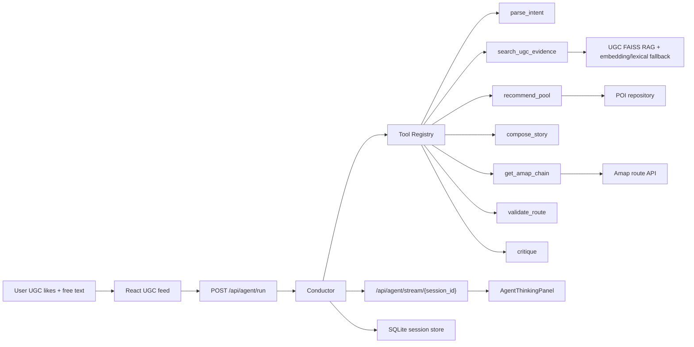

# AIroute - Multi-Agent Local Route Planner

[Design Doc](docs/agent_development_plan.md) · [Finalization Plan](docs/agent_finalization_plan.md) · [Architecture](docs/agent_architecture.md)

AIroute 是一个面向本地即时出行的路线规划 agent：Conductor 主控调度 9 个工具，结合 UGC RAG、候选池推荐、高德真实路线、StoryAgent 叙事编排、Critic 校验和反馈修复，把“想吃本地菜、少排队、顺路拍照”这类自然语言需求变成可解释、可调整、可回放的路线。

## Architecture



## Tech Stack

FastAPI · Pydantic · React · TypeScript · Vite · Zustand · SQLite · FAISS · numpy · BGE-small-zh embedding · LongCat/OpenAI-compatible LLM · Amap Web Service

## Quick Start

```powershell
cd backend
pip install -e .[dev]
cd ..
python scripts/embed_ugc.py
python -m uvicorn app.main:app --app-dir backend --reload --port 8000
```

With the backend running, optionally seed demo memory:

```powershell
python scripts/warmup_demo_sessions.py
```

```powershell
cd frontend
npm install
npm run dev
```

Open http://127.0.0.1:5173, like a few UGC cards, then generate an instant route.

## Configuration

```powershell
AMAP_WEB_SERVICE_KEY=your_amap_web_service_key
LLM_PROVIDER=longcat
LLM_BASE_URL=https://api.longcat.ai/v1
LLM_MODEL=longcat-max
LLM_API_KEY=your_llm_key
AGENT_TOOL_CALLING_ENABLED=true
```

Optional observability settings:

```powershell
LOG_LEVEL=INFO
OTEL_SERVICE_NAME=airoute-agent
OTEL_EXPORTER_OTLP_ENDPOINT=http://127.0.0.1:4317
```

Frontend map keys:

```powershell
VITE_AMAP_JS_KEY=your_amap_js_key
VITE_AMAP_SECURITY_JS_CODE=your_amap_security_js_code
VITE_API_BASE_URL=http://127.0.0.1:8000/api
```

## Observability

The backend emits JSON logs with `session_id`, `trace_id`, `user_id`, and `goal_kind` context. Prometheus metrics are exposed at `/metrics`, including agent run latency, tool latency, LLM token counters, Amap request counters, hallucination counters, cache hits, and memory-layer usage.

Per-session cost and latency can be queried after an agent run:

```powershell
curl http://127.0.0.1:8000/api/agent/cost/{session_id}
```

OpenTelemetry tracing is off by default. To view spans locally, start an OTLP-compatible collector such as Jaeger, then set `OTEL_EXPORTER_OTLP_ENDPOINT` before starting the backend:

```powershell
docker run --rm -p 16686:16686 -p 4317:4317 jaegertracing/all-in-one:latest
$env:OTEL_EXPORTER_OTLP_ENDPOINT='http://127.0.0.1:4317'
python -m uvicorn app.main:app --app-dir backend --reload --port 8000
```

Jaeger UI is available at http://127.0.0.1:16686.

## Cache Strategy

AIroute uses local caches by default, without requiring Redis:

- Amap route segments are persisted in SQLite at `data/processed/amap_cache.sqlite`; repeated identical origin/destination/mode segments avoid upstream Amap calls.
- LLM tool-choice responses are cached in memory for 5 minutes when the upstream call succeeds; fallback responses are not cached.
- BGE query embeddings are cached in a 500-entry in-memory LRU shared by UGC search and similar-session search.
- Cache hits and misses are exposed through `agent_cache_hits_total`; Amap cache status is also included on `agent_amap_requests_total`.

Inspect the Amap cache directly:

```powershell
sqlite3 data/processed/amap_cache.sqlite "SELECT COUNT(*), AVG(hit_count) FROM amap_segments"
```

## Quality Gates

Prompts are versioned under `backend/app/agent/prompts`; story runs record refs like `prompt:story@v1.0.0` on tool calls and trace events.

Local quality checks:

```powershell
cd backend
pytest tests/test_quality_engineering.py tests/test_agent_snapshots.py -q
mypy app/
```

Update the response-shape snapshot only when the API schema change is intentional:

```powershell
pytest tests/test_agent_snapshots.py --snapshot-update
```

Optional LLM quality gates consume tokens and are skipped by default:

```powershell
$env:RUN_LLM_EVAL='1'
pytest tests/test_prompt_regression.py -q

$env:RUN_LLM_JUDGE='1'
$env:JUDGE_LLM_API_KEY='your_judge_key'
pytest tests/test_agent_quality.py -q
```

## Verify

```powershell
curl http://127.0.0.1:8000/api/agent/tools
curl http://127.0.0.1:8000/api/agent/stream/{session_id}
curl http://127.0.0.1:8000/metrics
curl http://127.0.0.1:8000/api/agent/cost/{session_id}
curl http://127.0.0.1:8000/metrics | findstr agent_cache_hits
python scripts/replay_trace.py {session_id}
cd backend
pytest -q
pytest tests/test_agent_eval.py -q
pytest tests/test_quality_engineering.py tests/test_agent_snapshots.py -q
mypy app/
cd ../frontend
npm test
npm run build
```

## Core Endpoints

- `POST /api/agent/run`
- `POST /api/agent/adjust`
- `GET /api/agent/trace/{session_id}`
- `GET /api/agent/stream/{session_id}`
- `GET /api/agent/tools`
- `GET /api/agent/cost/{session_id}`
- `POST /api/route/chain`
- `GET /api/ugc/feed`
- `GET /metrics`

Design details are in [docs/agent_development_plan.md](docs/agent_development_plan.md) and [docs/agent_finalization_plan.md](docs/agent_finalization_plan.md).
