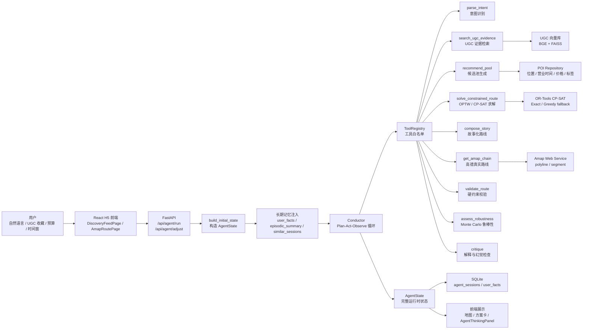
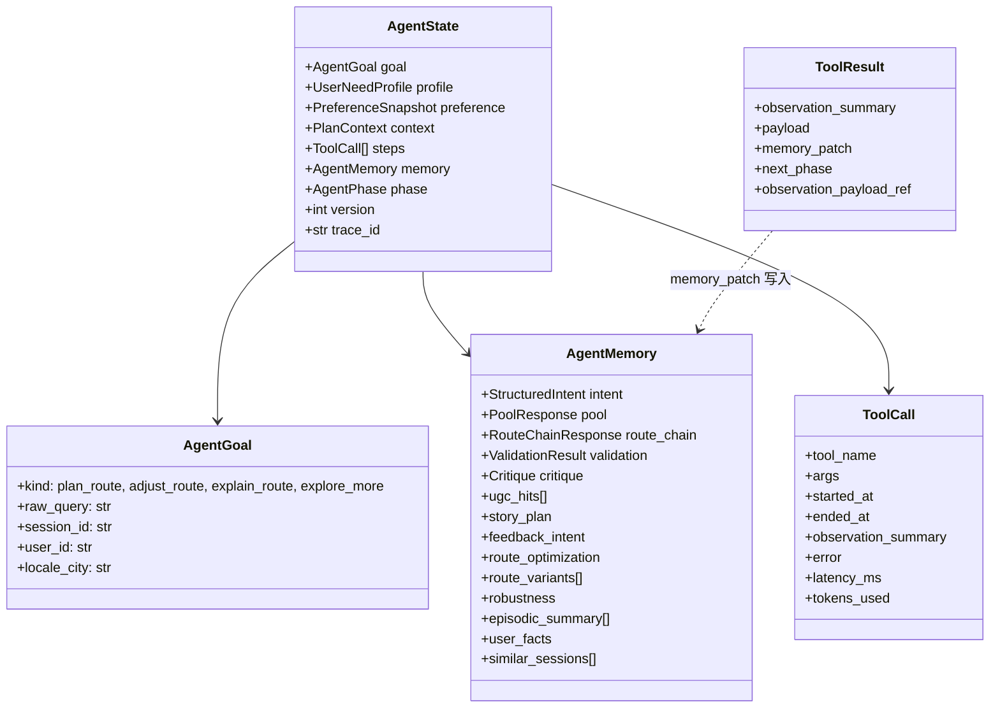
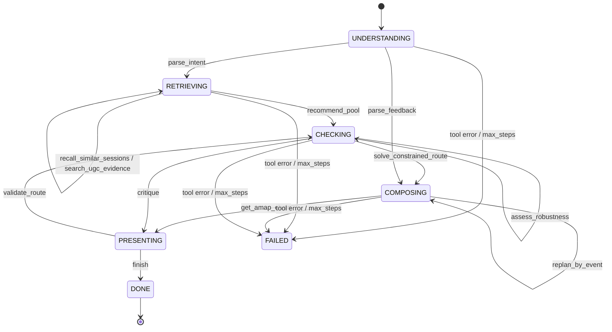
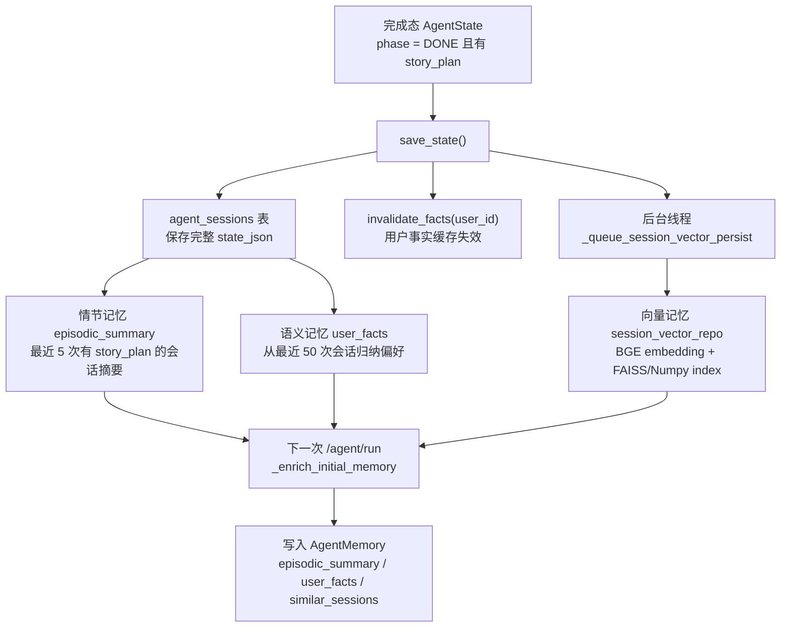
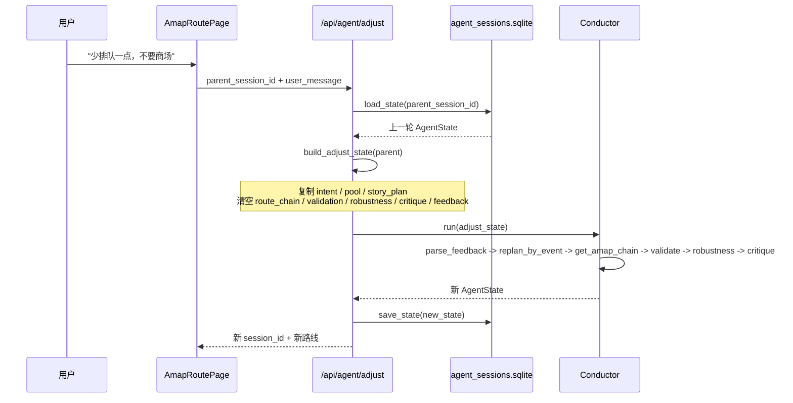
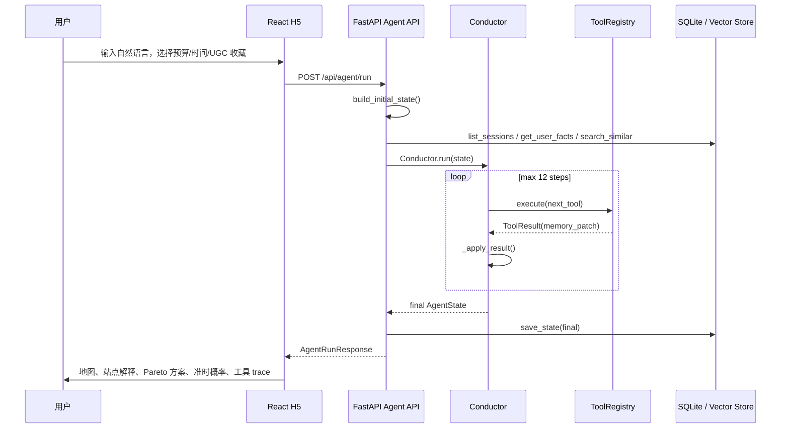

# AIroute 技术复盘：面试深挖版

> 目标：这份文档用于面试时讲清楚 AIroute 项目的系统设计、Agent 状态流转、技术选型、指标含义、可追问点和完整回答框架。重点不是“炫技术栈”，而是证明这个项目从用户需求到路线结果，是一条可解释、可约束、可评测、可回放的工程闭环。

---

## 1. 一句话项目定位

AIroute 是一个面向本地出行场景的智能路线规划系统。用户通过自然语言、UGC 收藏、预算、时间窗、出发位置等信息表达需求，系统通过 Agent 编排多个工具，把需求拆成结构化意图、候选 POI 检索、约束求解、路线叙事、高德路线链路、约束校验、鲁棒性评估和多轮反馈调整，最终输出一条带解释、带证据、可调整的本地路线。

面试里可以这样概括：

> 这个项目不是让 LLM 直接生成一段 JSON 路线，而是把 LLM/Agent 放在“调度和解释”位置，把路线可行性、约束满足、最优性和评测交给确定性模块。核心设计是 `Conductor + ToolRegistry + AgentState`：Conductor 决定下一步工具，工具只通过 `memory_patch` 修改 AgentState，最后整个状态持久化到 SQLite，支持 trace、回放和多轮 adjust。

---

## 2. 系统整体架构



代码入口对应关系：

| 环节 | 代码位置 | 作用 |
| --- | --- | --- |
| 前端发起规划 | `frontend/src/pages/DiscoveryFeedPage.tsx` | 收集 query、time_window、budget、UGC 偏好，调用 `runAgentRoute()` |
| 前端多轮反馈 | `frontend/src/pages/AmapRoutePage.tsx` | 用户输入反馈，调用 `adjustAgentRoute({ parent_session_id })` |
| Agent API | `backend/app/api/routes_agent.py` | `/agent/run`、`/agent/adjust`、trace、stream、cost、user facts |
| Agent 状态模型 | `backend/app/agent/state.py` | 定义 `AgentGoal`、`AgentMemory`、`AgentState`、`ToolCall` |
| Agent 调度器 | `backend/app/agent/conductor.py` | 决策下一个工具、执行工具、写 trace、推进 phase |
| 工具注册与实现 | `backend/app/agent/tools.py` | 12 个工具，统一返回 `ToolResult(memory_patch=...)` |
| 状态持久化 | `backend/app/agent/store.py` | SQLite 保存完整 state，支持 load/list/cost/vector persist |
| 长期记忆 | `backend/app/agent/user_memory.py`、`backend/app/repositories/session_vector_repo.py` | 用户事实归纳、历史会话向量检索 |
| 离线评测 | `backend/eval/run_eval.py`、`backend/eval/metrics.py` | 指标计算、CI gate |

---

## 3. Agent 状态设计图

### 3.1 数据结构图



理解这个图时抓住三个点：

1. `AgentState` 是一次 Agent 运行的唯一事实源，前端最终拿到的 `AgentRunResponse` 也是从 `state.memory` 中抽取出来的。
2. `AgentMemory` 是短期任务记忆，保存本轮从 intent 到 story、route、validation、robustness 的所有中间产物。
3. 每个工具不直接返回最终答案，而是返回 `ToolResult`；Conductor 统一读取 `memory_patch` 并写回 `state.memory`。这让状态更新路径集中、可追踪、可回放。

### 3.2 状态推进图



`Conductor.MAX_STEPS = 12`，所以它不是无限循环。每一轮执行：

1. `_decide(state)` 决定下一步工具。
2. `ToolRegistry.execute(tool, state, args)` 执行工具。
3. 记录 `ToolCall`，包括耗时、tokens、错误、observation。
4. `_apply_result()` 把 `ToolResult.memory_patch` 写入 `state.memory`。
5. 根据 `next_phase` 推进状态，直到 `finish` 或失败。

---

## 4. Agent 的短期记忆与长期记忆

### 4.1 短期记忆：当前任务状态

短期记忆就是 `AgentMemory`，它服务于“当前这一次路线规划/调整”。典型字段如下：

| 字段 | 由谁写入 | 被谁消费 | 作用 |
| --- | --- | --- | --- |
| `intent` | `parse_intent` | `recommend_pool`、`solve_constrained_route`、`validate_route` | 结构化硬约束与软偏好 |
| `ugc_hits` | `search_ugc_evidence` | `recommend_pool`、`compose_story` | 提供 POI 推荐和解释证据 |
| `pool` | `recommend_pool` | `solve_constrained_route`、`compose_story`、前端 | 候选 POI 池和默认选中路线 |
| `route_optimization` | `solve_constrained_route` | `compose_story`、前端 | 求解器、目标值、gap、fallback 信息 |
| `route_variants` | `solve_constrained_route` | 前端 Pareto 方案卡 | 多目标非支配候选方案 |
| `story_plan` | `compose_story` / `replan_by_event` | `get_amap_chain`、`validate_route`、前端 | 可展示的路线叙事和站点理由 |
| `route_chain` | `get_amap_chain` | `validate_route`、前端地图 | 高德真实路线分段、距离、耗时 |
| `validation` | `validate_route` | `critique`、前端 | 硬约束校验结果 |
| `robustness` | `assess_robustness` | `compose_story`、前端 | 准时概率、P90 总时长、超时风险 |
| `critique` | `critique` | Conductor finish 判断 | 解释质量、偏好匹配、是否需要重试 |
| `feedback_intent` | `parse_feedback` | `replan_by_event` | 用户反馈结构化结果 |

### 4.2 长期记忆：跨会话偏好复用

长期记忆不是简单保存一大段聊天历史，而是拆成三层：



三层记忆的设计原因：

| 记忆层 | 存什么 | 为什么这样设计 |
| --- | --- | --- |
| 情节记忆 `episodic_summary` | 最近 5 次路线摘要、主题、站点、反馈 | 用于让 Agent 知道用户最近玩过什么，避免路线重复，保持上下文连续性 |
| 语义记忆 `user_facts` | 常见预算、出行类型、偏好时间段、喜欢区域/品类、规避 POI | 把多次行为压缩成稳定画像，避免每次都检索大量历史 |
| 向量记忆 `similar_sessions` | 历史会话文本 embedding 后的 top-k 相似路线 | 当当前 query 和某次历史需求语义相似时，直接召回可复用经验 |

### 4.3 多轮对话如何支持

多轮反馈不是把所有聊天记录拼进 prompt，而是通过 `parent_session_id` 复用上一轮结构化状态：



面试回答重点：

> 这个 Agent 支持任务型多轮对话。它不是通用聊天式的上下文拼接，而是通过 `parent_session_id` 读取上一轮完整 `AgentState`，深拷贝后进入 `adjust_route` 模式。这样可以保留意图、候选池、路线故事等可复用上下文，同时清空路线链路、校验、鲁棒性和 critique 等需要重新计算的派生产物，保证反馈后不会拿旧结果冒充新结果。

---

## 5. 端到端交互链路

### 5.1 首次规划



首次规划的关键细节：

1. 前端在 `DiscoveryFeedPage` 中调用 `syncSnapshot()`，把用户 UGC 收藏偏好同步成 `preference_snapshot`。
2. 前端调用 `runAgentRoute()`，请求体包含 `free_text`、`time_window`、`budget_per_person`、`need_profile`、`preference_snapshot`、出发经纬度和半径。
3. 后端 `build_initial_state()` 生成 `AgentState`，然后 `_enrich_initial_memory()` 注入长期记忆。
4. `Conductor` 走工具链：意图识别、UGC 检索、候选池、约束求解、故事生成、高德路线、校验、鲁棒性、critique。
5. 最终状态被 `save_state()` 存到 SQLite，完成态会话异步写入 session vector index。

### 5.2 反馈调整

反馈调整的链路更短，但更能体现状态设计价值：

1. 前端地图页保留上一次 `session_id`。
2. 用户提交反馈时，前端调用 `/agent/adjust` 并传 `parent_session_id`。
3. 后端 `load_state(parent_session_id)` 找到上一轮状态。
4. `build_adjust_state()` 深拷贝父状态，修改 `goal.kind = adjust_route`，重置 `steps / phase / trace_id`，清空需要重算的派生字段。
5. Conductor 的 adjust 分支先 `parse_feedback`，再 `replan_by_event`，然后重新获取路线链、重新校验、重新评估鲁棒性、重新 critique。

---

## 6. 意图识别是怎么做的

当前 Agent 的意图识别由 `parse_intent` 工具完成，核心逻辑在 `backend/app/agent/tools.py` 的 `_rule_parse_intent()`。

它不是单纯让 LLM 自由发挥，而是把用户输入映射到固定 schema：

```text
StructuredIntent
├── hard_constraints
│   ├── start_time / end_time
│   ├── budget_total
│   ├── transport_mode
│   ├── must_include_meal
│   └── must_include_experience
├── soft_preferences
│   ├── pace
│   ├── avoid_queue
│   ├── weather_sensitive
│   ├── photography_priority
│   ├── food_diversity
│   └── custom_notes
├── must_visit_pois
└── avoid_pois
```

识别规则包括：

1. **硬约束来自上下文优先**：时间窗、预算、城市、出发点从 `PlanContext` 和前端表单进入，不依赖模型猜。
2. **预算会结合长期记忆**：如果本次没传预算，会从 `user_facts.typical_budget_range` 取历史预算上界作为默认值。
3. **关键词提取软偏好**：比如少排队、拍照、打卡、吃饭、本地菜、雨天、室内等词会影响 `avoid_queue`、`photography_priority`、`food_diversity`、`weather_sensitive`。
4. **历史拒绝 POI 注入规避列表**：`user_facts.rejected_poi_ids` 和 `profile.must_avoid` 会合并到 `avoid_pois`。
5. **hard/soft 分离**：预算、时间、必须包含餐饮属于硬约束；少排队、拍照、节奏属于软偏好，后续排序和求解会用不同方式处理。

面试可以这样回答：

> 我没有让 LLM 直接决定整条路线，因为路线规划里硬约束错误的代价很高。我的设计是先把用户输入转成 `StructuredIntent`，其中时间窗、预算、出发点这类硬约束由前端上下文和用户画像提供，少排队、拍照、本地菜这类软偏好通过规则和关键词识别进入 `soft_preferences`。这样后续求解器可以明确知道哪些约束必须满足，哪些只是优化目标。

当前局限也要主动说明：

> 现在的意图识别偏规则化，优点是可控、稳定、便于评测；缺点是泛化能力不如 LLM。下一步我会把规则 parser 作为 fallback，引入 LLM structured output 做主解析，并保留 schema 校验、置信度和回退路径。

---

## 7. 路线规划为什么不用 LLM 直接生成

这是面试很容易深挖的问题。建议回答：

> 路线规划本质上是一个带时间窗、预算、营业时间、必去点、品类覆盖和交通成本的组合优化问题。LLM 擅长理解意图和生成解释，但不擅长保证约束一定满足，也无法稳定给出最优性证据。所以我把 LLM 放在编排和叙事层，把可行性和优化交给确定性模块。

项目里的分层是：

| 层 | 负责什么 | 为什么不用 LLM 直接做 |
| --- | --- | --- |
| 意图层 | 把自然语言转成结构化约束 | 需要 schema、可校验、可回退 |
| 检索层 | 找候选 POI 和 UGC 证据 | 需要 provenance，避免解释无来源 |
| 排序层 | 估计 POI 与用户需求匹配度 | 需要稳定打分和可评测 NDCG |
| 求解层 | 选择并排序路线 | 需要硬约束、时间窗、预算、近似最优 |
| 叙事层 | 生成路线主题和理由 | 这是 LLM/StoryAgent 更适合的部分 |
| 校验层 | 验证路线是否越界 | 不能靠模型自证，必须独立校验 |

---

## 8. 约束求解与 Pareto 方案

### 8.1 OPTW 建模

路线求解在 `solve_constrained_route` 工具中进行，核心抽象是 `OptwNode`：

```text
OptwNode
├── poi_id
├── category
├── utility          # suitable_score * 100
├── visit_min        # 停留时间
├── price            # 单点消费
├── open_min/close_min
└── queue_min
```

问题可以理解成 OPTW，也就是带时间窗的定向越野问题：

> 在给定开始时间、结束时间、预算、最大站点数、营业时间、必去点和品类要求下，选择并排序一组 POI，使总效用最大，同时总时间和成本不越界。

求解器策略：

1. 默认用 OR-Tools CP-SAT。
2. 候选过多或指定 greedy 时使用 greedy fallback。
3. CP-SAT 不可用时，小规模场景用 exact search。
4. 不可行时返回 greedy fallback，并在 `constraint_violations` 标记原因，而不是静默失败。

### 8.2 Pareto 多方案

项目不是只输出一条路线，还会输出不同取舍的非支配方案：

| 方案 profile | 倾向 |
| --- | --- |
| `interest` | 兴趣/适配度最高 |
| `balanced` | 兴趣、时间、花费、排队折中 |
| `time_saving` | 更省时间 |
| `budget_saving` | 更省钱 |
| `low_queue` | 更少排队 |

`build_pareto_variants()` 会用不同权重并行求解，再根据四个维度做非支配过滤：

```text
interest 越高越好
time 越低越好
cost 越低越好
queue 越低越好
```

如果一个方案在所有维度都不差于另一个方案，并且至少一个维度更好，就支配对方。最终前端只展示非支配解。

---

## 9. 指标如何解释

### 9.1 硬约束满足率

来源：`backend/eval/run_eval.py` 调用 `/api/agent/run`，然后读取 `validation.is_valid`。

校验逻辑在 `RouteValidator` 中，包括：

1. POI 数量至少 3 个。
2. 如果用户要求吃饭，路线必须包含餐饮点。
3. 如果用户要求体验类活动，路线必须包含文化/娱乐/景点/夜景等体验类 POI。
4. 到达时间必须在 POI 营业时间内。
5. 总时长不能超过用户时间窗。
6. 总预算不能超过预算。
7. 必去点不能缺失。
8. 少排队偏好下，排队阈值更严格。

面试回答：

> 硬约束满足率不是主观指标，而是独立 validator 对最终 `RouteSkeleton` 做校验。只要存在 error 级别 issue，就不算满足。这样可以避免模型自己生成解释、自己证明正确的问题。

### 9.2 为什么解释忠实度是 1

来源：`backend/eval/metrics.py` 的 `explanation_faithfulness()`。

计算方法：

1. 遍历 `story_plan.stops`。
2. 找到每个 stop 对应的真实 POI。
3. 检查 `stop.why` 是否能和 POI 的可验证字段匹配：
   - 是否包含 POI category；
   - 是否包含 rating；
   - 是否包含 POI 的 high frequency keywords。
4. `ok / total`，保留三位小数。

所以忠实度 = 1 的意思是：

> 在离线评测样本中，每个站点的解释都至少命中了它对应 POI 的一个真实属性或关键词，因此自动 groundedness proxy 得分为 1。

需要注意表达边界：

> 这个指标不能证明解释里的每个自然语言细节都 100% 真实，它证明的是解释没有脱离候选 POI 的结构化证据。更严格的生产标准应该加入 UGC quote 对齐、人工标注评审和 hallucination classifier。

### 9.3 最优解 gap 怎么算，0.001 是否现实

来源：`backend/eval/run_eval.py` 的 `_route_quality_gap()`。

计算过程：

1. 从 Agent 生成的 pool 中取候选 POI。
2. 构造最多 8 个评测候选：已选 POI + 高分候选。
3. 把每个 POI 转成 `OptwNode`，其中 `utility = suitable_score * 100`。
4. 用 simplified travel matrix，任意两个 POI 之间默认 10 分钟。
5. 用 exact solver 求这个小候选空间下的 oracle 最优解。
6. 计算：

```text
gap = max(0, (exact.selected_utility - selected_utility) / exact.selected_utility)
```

如果 gap = 0.001，意思是：

> 在离线评测构造的小候选集合和简化交通假设下，Agent 选择路线的效用距离 exact oracle 只差约 0.1%。

是否符合现实标准，要分两层说：

1. **作为离线工程回归指标，0.001 是很好的**：说明当前求解器在评测候选集里几乎没有损失，CI 可以用它防止路线质量退化。
2. **不能把它宣传成真实世界全局最优**：真实世界还涉及实时交通、临时闭店、用户临场情绪、POI 数据误差、UGC 偏差和动态排队。现实标准更应该看线上点击率、采纳率、用户调整率、到店转化、人工满意度和真实导航耗时。

面试回答：

> 这个 gap 是“离线 oracle gap”，不是“真实城市全局最优 gap”。我用它做工程回归，因为它可重复、可自动化、能判断求解器有没有退化。真实生产里我会把它和线上行为指标结合，比如用户是否接受路线、是否频繁手动替换 POI、是否超时、是否投诉解释不可信。

### 9.4 NDCG@5

NDCG@5 用来评估候选 POI 排序质量。项目里排序不是只看距离或评分，而是综合用户偏好、UGC、类别、预算、排队、距离等因素。NDCG@5 适合衡量“前 5 个推荐是否把高相关 POI 排在前面”。

面试回答：

> 路线规划前要先有高质量候选池。如果候选池质量差，后面求解器再强也只能在差候选里选。NDCG@5 关注 top-k 的排序质量，和路线推荐场景更匹配，因为用户主要看到和使用前几个 POI。

### 9.5 鲁棒性与准时概率

`assess_robustness` 工具会把最终路线转成 `RouteSkeleton`，然后调用 Monte Carlo 模拟：

1. 对每个站点停留时长、排队时间、交通耗时加入扰动。
2. 重复模拟默认 500 次。
3. 输出：
   - `on_time_prob`：在时间窗内完成概率；
   - `expected_overflow_min`：期望超时分钟数；
   - `p90_total_min`：90 分位总耗时。

回答重点：

> 传统路线只给一个确定性耗时，但现实中排队和路况有波动。Monte Carlo 的作用是把“这条路线看起来可行”升级成“这条路线在不确定性下有多稳”。前端展示准时概率，比只展示总耗时更符合真实决策。

---

## 10. 技术选型原因

| 技术 | 选择原因 | 面试可讲细节 |
| --- | --- | --- |
| React + Vite | H5 交互速度快，开发反馈快 | 适合 UGC feed、地图页、方案切换、Agent trace 面板 |
| Zustand | 轻量前端状态管理 | 用于跨页面保存 routeRequest、pool、session_id |
| FastAPI | 类型友好、API 定义清晰、测试方便 | `response_model` 保证出参结构，`TestClient` 支持离线评测 |
| Pydantic | Agent 状态和接口 schema 强约束 | `AgentState`、`StructuredIntent`、`AgentRunResponse` 都可序列化/校验 |
| SQLite | 本地 demo 和评测可复现 | 保存完整 `state_json`，不依赖复杂外部服务 |
| FAISS + BGE | 中文语义检索，支持本地向量召回 | UGC 检索和历史会话相似召回 |
| LightGBM LambdaMART | 更适合排序问题 | 直接优化 ranking，适合 top-k POI 推荐 |
| OR-Tools CP-SAT | 适合组合优化和硬约束 | 时间窗、预算、必去点、最大站点数都能建模 |
| Amap Web Service | 真实地图路线 | 用真实 distance、duration、polyline 替代纯直线距离 |
| Monte Carlo | 处理现实不确定性 | 估计准时概率、P90 耗时和超时风险 |
| Prometheus + OpenTelemetry | 可观测性 | 每个工具延迟、Agent 总耗时、memory layer 使用都有指标 |

---

## 11. 可能被深挖的方向与回答要点

### 11.1 “你这个 Agent 到底智能在哪里？”

回答：

> 智能不只是 LLM 生成文本，而是系统能根据当前状态选择下一步动作，并把多种专业能力组合起来。这个项目里 `Conductor` 会根据 `AgentMemory` 判断是否已经有 intent、pool、story、route、validation、robustness、critique，然后选择下一个工具。比如还没有候选池就不会直接生成路线，还没有路线链路就不会校验真实分段。每个工具的结果写回 `AgentState`，后续动作都基于这个状态继续推进。

追问点：

- LLM tool calling 是否开启？
- 规则 fallback 怎么做？
- 为什么要限制 MAX_STEPS？

补充：

> 当前配置里支持 LLM tool calling，但也有 rule-based decision fallback。这样无 LLM key 或需要低延迟时，Agent 仍然能稳定跑完整链路。`MAX_STEPS = 12` 是为了防止工具循环和成本失控。

### 11.2 “Agent 的状态为什么这么设计？”

回答：

> 我把状态分成 goal、context、profile、steps 和 memory。goal 描述这次任务是什么，context 是硬环境信息，profile 是用户需求画像，steps 是执行轨迹，memory 是中间产物。这样设计的好处是职责清晰：工具不需要知道前端页面怎么组织，也不需要直接操作数据库，只读写 `AgentState`。最终持久化完整 state 后，可以 trace、debug、回放、多轮调整和统计成本。

可以主动指出：

> `steps` 是面向可观测性的，`memory` 是面向推理的，`context/profile` 是面向约束的。这三个不要混在一起。

### 11.3 “多轮对话和普通聊天有什么区别？”

回答：

> 普通聊天通常依赖上下文窗口，把历史消息拼进 prompt。我的场景是路线规划，多轮反馈更重要的是复用上一轮结构化结果。所以我用 `parent_session_id` 找回上一轮完整 AgentState，复制后清空需要重算的字段，再进入 adjust_route 流程。这样可以避免上下文过长，也避免模型误解历史对话。

### 11.4 “长期记忆会不会污染本轮结果？”

回答：

> 有这个风险，所以我把长期记忆分层并控制注入方式。`user_facts` 只作为默认偏好和规避列表，不直接覆盖用户本轮显式约束；`similar_sessions` 是参考历史，不是强制照搬；`episodic_summary` 主要用于避免重复和提供上下文。本轮显式输入优先级最高，比如用户本轮传了预算，就不会用历史预算覆盖。

### 11.5 “为什么用 SQLite，不用 Redis/Postgres？”

回答：

> 这个项目是本地路线规划 demo 和评测系统，目标是可复现和低部署成本。SQLite 足够保存 session state、user_facts，并且方便 CI 和离线 eval。生产环境可以迁到 Postgres 保存会话和用户事实，用 Redis 做短期缓存和 SSE fanout，用向量数据库替代本地 FAISS 文件。

### 11.6 “为什么有了 CP-SAT 还要 greedy fallback？”

回答：

> 因为工程系统要保证可用性。CP-SAT 在约束复杂、候选较多或依赖缺失时可能超时或不可用。如果直接失败，用户体验很差。所以我做了 fallback：先保证必去点和必需品类，再按效用补齐，并在 `constraint_violations` 中标记原因。这样前端和评测都知道这条路线是 fallback，不会误认为它是严格最优。

### 11.7 “解释忠实度怎么防止模型幻觉？”

回答：

> 我做了两层：一是 StoryAgent 生成解释时只基于候选池和 UGC evidence；二是 eval 的 explanation_faithfulness 会检查每个 stop 的 why 是否命中 POI 的 category、rating 或高频关键词。Critic 也会检查 hallucinated_poi 和 hallucinated_ugc。它不是完美的事实核验，但能防止最常见的无来源解释。

### 11.8 “你怎么证明路线真的好？”

回答：

> 我没有只看 demo 主观效果，而是做了离线 eval。指标包括 feasible rate、constraint satisfaction、explanation faithfulness、route quality gap、NDCG@5、Pareto variant count、on-time probability。特别是 route gap 用 exact solver 做小规模 oracle 对比，NDCG@5 评估候选排序，constraint satisfaction 用独立 validator 判断。这些指标组合起来覆盖了可行性、解释可信度、优化质量和鲁棒性。

### 11.9 “这个项目最大的工程难点是什么？”

回答：

> 最大难点是把不确定的自然语言需求变成可验证的路线结果。难点不在单个模型调用，而在边界设计：哪些交给 LLM，哪些交给确定性求解器，状态怎么流转，失败怎么降级，指标怎么证明。比如 LLM 可以帮忙生成 story，但不能负责硬约束；求解器能保证约束，但不懂用户表达；所以需要 Agent 编排把它们串起来。

### 11.10 “如果上线生产，你会优先改哪里？”

回答：

1. 意图识别从规则升级为 LLM structured output + 规则 fallback + 置信度。
2. 路线 gap 引入真实交通矩阵，不再用离线固定 10 分钟矩阵。
3. 用户记忆增加显式授权、可编辑、可删除，避免隐私问题。
4. 向量记忆从本地 FAISS 文件升级为服务化向量库。
5. 加入线上行为指标：采纳率、二次调整率、实际导航完成率、解释投诉率。
6. 对 UGC 证据做更严格的 provenance 对齐和内容安全过滤。

---

## 12. 面试完整回答模板

### 12.1 项目总览回答

> AIroute 是一个本地出行路线规划 Agent。用户输入自然语言需求和一些显式条件，比如时间窗、预算、出发点，也可以通过 UGC 收藏表达偏好。系统后端用 FastAPI 暴露 `/api/agent/run` 和 `/api/agent/adjust`，核心是 `Conductor + ToolRegistry + AgentState`。Conductor 会按状态选择工具，比如先解析意图，再检索 UGC 证据，生成候选池，然后用 OPTW/CP-SAT 做约束求解，再生成路线故事、调用高德路线、做硬约束校验、Monte Carlo 鲁棒性评估和 Critic 检查。最终结果会返回给 React H5，展示地图、站点理由、Pareto 多方案、准时概率和 Agent 执行轨迹。
>
> 这个项目的关键点是没有让 LLM 直接生成最终路线，而是把路线规划拆成可控模块：LLM/Agent 负责理解和编排，检索负责证据，排序负责候选质量，求解器负责约束和优化，validator 负责兜底校验，eval 负责证明效果。

### 12.2 Agent 架构回答

> Agent 的状态模型是 `AgentState`。它包含 `goal`、`profile`、`context`、`steps`、`memory` 和 `phase`。`goal` 表示这次任务是首次规划还是调整路线；`context` 保存时间窗、城市、预算、出发点等硬环境；`profile` 是用户画像；`steps` 记录每个工具调用的参数、耗时、错误和 observation；`memory` 保存中间结果，比如 intent、pool、story_plan、route_chain、validation、robustness。
>
> 每个工具统一返回 `ToolResult`，里面有 `memory_patch` 和 `next_phase`。Conductor 不关心工具内部细节，只负责执行工具并把 `memory_patch` 写回 `state.memory`。这样状态变更集中在一个路径上，便于 trace、debug、回放和多轮调整。

### 12.3 记忆设计回答

> 我把记忆分成短期记忆和长期记忆。短期记忆就是当前 `AgentMemory`，保存这次规划过程里的意图、候选池、路线、校验、鲁棒性和反馈。长期记忆分三层：最近会话摘要 `episodic_summary`，用户画像 `user_facts`，以及向量相似历史 `similar_sessions`。
>
> 用户事实会从最近 50 次完成路线里归纳预算、常用时间段、喜欢品类、喜欢区域、拒绝 POI 等；相似会话会把历史 session summary 用 BGE 编码后写入 FAISS/Numpy index，下次按 query 找 top-k。这样既不会把全部历史聊天塞进 prompt，也能在新请求里复用稳定偏好。

### 12.4 多轮反馈回答

> 多轮反馈通过 `parent_session_id` 实现。前端地图页保存上一次 `session_id`，用户说“少排队一点”时，请求 `/agent/adjust`。后端用 `load_state(parent_session_id)` 找到父状态，深拷贝后改成新的 `adjust_route` goal，然后清空旧的 route_chain、validation、robustness、critique 和 feedback 字段。Conductor 进入 adjust 分支，先 `parse_feedback`，再 `replan_by_event`，然后重新获取高德路线、重新校验和评估鲁棒性。这样能复用上一轮候选池和 story，又不会复用过期的路线派生结果。

### 12.5 技术选型回答

> 前端用 React + Vite 是因为 H5 交互多、开发反馈快；Zustand 用来保存跨页面路线状态。后端用 FastAPI + Pydantic，是因为接口 schema 清楚，AgentState 能直接序列化和校验，离线 eval 可以用 TestClient 调接口。检索用 BGE + FAISS，因为中文语义检索效果和本地部署成本比较平衡。排序用 LightGBM LambdaMART，因为 POI 推荐本质是 top-k ranking，NDCG 比分类准确率更贴合目标。路线求解用 OR-Tools CP-SAT，因为时间窗、预算、必去点、最大站点数都是典型约束优化问题。鲁棒性用 Monte Carlo，因为真实路线会受到交通和排队波动影响。

### 12.6 指标回答

> 我用多指标证明项目，而不是只展示 demo。硬约束满足率来自独立 `RouteValidator`；解释忠实度来自每个站点 why 和真实 POI 字段的匹配；route quality gap 用 exact solver 在小规模候选集上做 oracle 对比；NDCG@5 衡量候选 POI 排序质量；on-time probability 用 Monte Carlo 模拟路线在不确定性下准时完成的概率。这些指标分别覆盖可行性、解释可信度、优化质量、候选质量和鲁棒性。

### 12.7 局限性回答

> 当前项目仍然有 demo 阶段限制。第一，意图识别偏规则化，泛化不足；第二，离线 gap 使用简化交通矩阵，不能代表真实城市全局最优；第三，用户记忆还缺少更完整的隐私和可编辑机制；第四，UGC 证据核验还可以更严格。我的优化方向是 LLM structured intent + fallback、真实交通矩阵评测、服务化向量库、线上行为指标和更强的证据对齐。

---

## 13. 面试时可以主动抛出的亮点

1. **状态机式 Agent，而不是 prompt 拼接**：所有工具产物都在 `AgentMemory` 中显式可见。
2. **LLM 不负责硬约束**：硬约束由 schema、求解器和 validator 共同保证。
3. **多轮反馈复用结构化状态**：`parent_session_id` 比聊天上下文更稳定。
4. **长期记忆分层**：情节摘要、用户事实、向量相似历史分别解决不同问题。
5. **可观测性完整**：每个工具都有 `ToolCall`、latency、tokens、trace 和 cost summary。
6. **评测闭环**：解释忠实度、最优解 gap、NDCG、鲁棒性不是口头描述，而是脚本可复现。
7. **工程降级路径**：LLM、CP-SAT、FAISS、Amap、Ranker 都有 fallback 思路，系统不会单点崩溃。

---

## 14. 快速背诵版

> 我这个项目的核心是把本地路线规划从“LLM 生成推荐文案”升级成“Agent 编排下的可验证路线规划系统”。用户输入自然语言和偏好后，前端把 query、预算、时间窗、UGC 收藏和出发位置传给 `/api/agent/run`。后端构造 `AgentState`，注入长期记忆，然后 Conductor 根据状态选择工具。工具链包括意图解析、UGC 检索、候选池生成、OPTW/CP-SAT 约束求解、故事生成、高德路线、约束校验、Monte Carlo 鲁棒性和 Critic 检查。
>
> 状态设计上，`AgentState` 是唯一事实源，`AgentMemory` 保存短期任务记忆，每个工具通过 `memory_patch` 写回状态。长期记忆分为用户事实、最近会话摘要和相似历史会话向量检索。多轮反馈通过 `parent_session_id` 读取上一轮完整状态，复制后清空旧路线派生结果，再按反馈重新规划。
>
> 技术选型上，FastAPI + Pydantic 保证接口和状态类型化，React + Vite 负责 H5 交互，FAISS + BGE 做语义检索，LightGBM LambdaMART 做 POI 排序，OR-Tools CP-SAT 做约束优化，高德提供真实路线，Monte Carlo 评估准时概率。评测上我用硬约束满足率、解释忠实度、route quality gap、NDCG@5 和 on-time probability 证明系统质量。
>
> 这个项目最大的价值是边界清楚：LLM 负责理解、编排和表达，求解器负责约束和优化，validator 负责校验，评测脚本负责证明效果。这样比单纯让模型生成一条路线更稳定、更可解释，也更适合工程落地。
