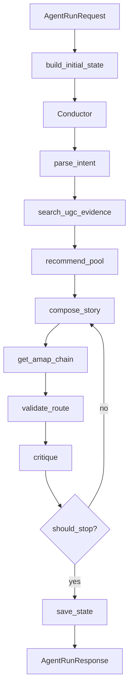

# AIroute Agent Architecture

AIroute 的 agent 链路把本地路线规划拆成一组可观测、可降级的工具调用。用户在前端 UGC Feed 中收藏内容并输入自由文本后，前端调用 `POST /api/agent/run`。后端构造 `AgentState`，再交给 `Conductor` 逐步决策下一步工具。

## State Model

`AgentState` 是整个链路的唯一上下文容器，包含目标、用户画像、偏好快照、时间预算、工具步骤和 memory。工具不直接相互调用，只通过 `memory_patch` 修改 state。这样前端、测试和 replay 脚本都能看到同一份执行轨迹。

## Tool Registry

`ToolRegistry` 注册 9 个工具：需求解析、UGC 召回、候选池、故事编排、高德路线、反馈解析、反馈重排、路线校验、Critic。Conductor 可以走 LLM tool calling，也可以在没有 API key 时走规则决策。这个双轨设计保证 demo 环境可演示，CI 环境也能稳定测试。

## UGC RAG

`UgcVectorRepo` 提供同一个 `search` 接口。存在 `ugc_hefei_embeddings.npy` 和 `ugc_hefei_meta.jsonl` 时走 BGE embedding 语义检索；文件缺失或依赖不可用时自动退回 lexical 检索。StoryAgent 使用 UGC hit 或候选池 quote 生成每个 stop 的 `why` 与 `ugc_quote`，并通过 `post_check` 防止引用不存在的 POI 或 quote。

## Tracing And Streaming

每个决策和工具观察都会写入 `app.agent.tracing`。`/api/agent/stream/{session_id}` 使用 `asyncio.Queue` 为 EventSource 推送增量 SSE，前端 `AgentThinkingPanel` 实时展示工具名、摘要和 latency。完成后 state 会持久化到 SQLite，`scripts/replay_trace.py` 可按 session id 回放。

## Feedback Loop

调整路线时，前端调用 `POST /api/agent/adjust`。后端从 SQLite 加载父 session，复制已有 story 和候选池，执行 `parse_feedback -> replan_by_event -> get_amap_chain -> validate_route -> critique`。RepairAgent 默认规则解析，启用 LLM 时会补充午餐、预算方向、类别等槽位。

## Failure Strategy

LLM、embedding、高德 API 都是可降级边界：LLM 失败返回 fallback JSON，embedding 缺失退回 lexical，高德测试用 fake client。Critic 对 validation 失败会触发一次 story retry，避免无限循环。最终 trace 中会保留失败工具和错误摘要，便于调试。
