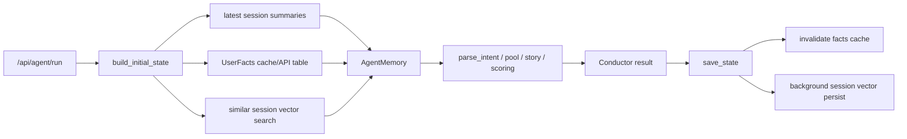

# Agent Memory Development Log

## Scope

This iteration implemented the agent memory layer for AIroute without adding an external database or service. The memory system is isolated by `user_id` and remains best-effort: route generation must continue when fact derivation, vector indexing, or similar-session recall fails.

## Architecture

The memory feature is split into three layers:

1. Episodic memory
   - Source: completed `AgentState` records in `agent_sessions.sqlite`.
   - Model: `SessionSummary`.
   - Builder: `app.agent.session_summarizer.summarize_session`.
   - Runtime use: `build_initial_state` loads the latest five completed sessions into `state.memory.episodic_summary`.

2. Semantic memory
   - Source: the latest 50 completed sessions for one user.
   - Model: `UserFacts`.
   - Builder/cache: `app.agent.user_memory`.
   - Storage: `user_facts` table in `agent_sessions.sqlite`.
   - Runtime use: initial state injects facts, intent parsing expands `avoid_pois`, pool generation and POI scoring apply category, budget, district, and rejected-POI signals.
   - API: `GET /api/agent/user/{user_id}/facts?force_refresh=false`.

3. Vector session recall
   - Source: completed sessions with a `story_plan`.
   - Model: `SimilarSessionHit`.
   - Repository: `app.repositories.session_vector_repo.SessionVectorRepo`.
   - Index path: `data/processed/sessions/`.
   - Embedding/index: `BAAI/bge-small-zh-v1.5` with FAISS `IndexFlatIP` when available, with a small numpy fallback for local tests.
   - Runtime use: `build_initial_state` performs best-effort recall; the agent tool registry also exposes `recall_similar_sessions(query, top_k?)`.

The high-level data flow is:

## Backend Implementation Notes

- `AgentMemory` now carries `episodic_summary`, `user_facts`, `similar_sessions`, and `similar_sessions_searched`.
- `save_state` invalidates the per-user facts cache and queues vector persistence on a daemon thread after completed sessions.
- `PoolService.generate_pool` receives `user_facts` and `ugc_hits`. It filters rejected POIs when possible and keeps expensive scoring to the selected shortlist.
- `PoiScoringService.score_poi` adds `fact_alignment`:
  - positive weight for favorite categories and districts;
  - negative weight for rejected POIs, avoided categories, and prices above the user's typical range.
- `StoryAgent` and replacement selection avoid rejected POIs through the parsed intent/profile path.
- `routes_agent` keeps the existing response shape compatible while adding the facts endpoint and initial memory enrichment.

## Frontend Implementation Notes

- `frontend/src/types/userMemory.ts` defines the `UserFacts` contract used by the panel.
- `fetchUserFacts(userId, forceRefresh?)` wraps the new API.
- `UserMemoryPanel` renders near the liked strip and hides when there are no derived facts.
- The route page now reuses an agent-returned `route_chain` instead of refetching the same Amap chain. This prevents a successful agent run from being overwritten by a later transient network failure.

## Problems Found And Fixes

### 1. Memory derivation could block route generation

Problem: facts derivation and vector recall touch local storage and optional ML dependencies. If they ran as hard requirements, a missing model or damaged index could break the route flow.

Fix: memory loading is best-effort. `build_initial_state` catches facts and recall failures, and `SessionVectorRepo` returns an empty hit list when dependencies are missing or files are invalid.

### 2. Saving sessions could become slow

Problem: writing a completed session into the vector index can be expensive because embedding model loading and FAISS persistence are outside the critical path of route generation.

Fix: `save_state` now invalidates facts synchronously but queues vector persistence on a daemon thread. The saved session is deep-copied before background work so later state mutation cannot leak into indexing.

### 3. Candidate pool generation was too slow

Problem: scoring every candidate with full UGC evidence lookup made `recommend_pool` the dominant latency source.

Fix: pool generation now uses a cheap shortlist score first, reuses UGC hits already gathered by the retrieval step, and only runs full scoring for the final selected pool.

### 4. Time-budget validation caused repeated route work

Problem: `time_budget_exceeded` triggered a full story retry, then repeated Amap chain construction without changing the route enough.

Fix: the critic now compacts the story for time-budget failures and avoids story retry for non-story quality issues. Amap route construction also compacts far POIs before calling the route API.

### 5. Route page showed `Network Error` after a successful agent run

Problem: `/api/agent/run` already returned `route_chain`, but the route page discarded it and made a second `/api/route/chain` request. If that second request failed, the UI showed `Network Error` and blank distance/duration.

Fix: the agent result's `route_chain` is stored in `AmapRouteRequest`; `AmapRoutePage` renders it directly when it matches the requested POI ids and mode.

## Code Review Notes

- Separation of concerns is clear:
  - schemas live in `app.schemas.user_memory`;
  - episodic summarization lives in `app.agent.session_summarizer`;
  - semantic derivation/cache lives in `app.agent.user_memory`;
  - vector persistence/search lives in `app.repositories.session_vector_repo`;
  - orchestration and API glue stay in `routes_agent`, `tools`, and `store`.
- Failure boundaries are appropriate for a demo and hackathon product: optional memory enhancements degrade to empty facts or empty recall, while the base route generation path continues.
- The main remaining production hardening item is observability. Silent best-effort catches are acceptable for the demo, but a production version should log suppressed facts/vector failures with user-safe metadata.
- The SQLite-backed `user_facts` cache is intentionally simple. If concurrent write volume grows, move facts and vector metadata behind a public repository abstraction instead of importing the store connection helper directly.

## Validation

Fresh verification run before commit:

- Backend memory and agent flow tests:
  - `pytest tests/test_agent_performance_flow.py tests/test_agent_minimal_flow.py tests/test_agent_stage3.py tests/test_agent_stage4.py tests/test_agent_memory_e2e.py tests/test_user_facts.py tests/test_session_vector.py -v`
- Frontend route/memory tests:
  - `npm test -- AmapRoutePage discoveryAmapRouteFlow UserMemoryPanel`
- Frontend production build:
  - `npm run build`
