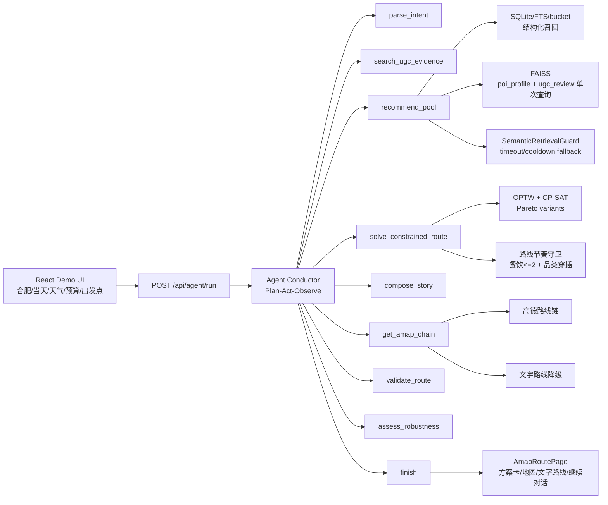

# AIroute 当前架构

本文描述当前合肥本地生活 Agent Demo 的真实链路。项目目标不是做一个通用旅游网站，而是做一个可迁移的路线智能体系统：先在合肥 Demo 跑通 UGC、结构化 POI、约束求解、地图降级、继续对话和离线评测，再替换真实数据源和线上基础设施。

---

## 主链路



---

## 后端模块

```text
backend/app
  agent/
    conductor.py                 Agent 工具编排、trace、fallback
    tools.py                     parse/retrieve/pool/solve/story/amap/validate/feedback tools
    specialists/story_agent.py   结构化 story plan 和推荐理由
    store.py / user_memory.py    会话、用户事实和跨会话记忆

  api/
    routes_agent.py              /api/agent/run、adjust、trace、stream、tools、cost
    routes_pool.py               候选池 API
    routes_route.py              高德路线链 API
    routes_ugc.py                UGC 发现流

  services/
    pool_service.py              结构化召回、预算优先、语义检索 guard、候选融合
    poi_scoring_service.py       预算、天气、排队、距离、偏好打分
    retrieval_service.py         FAISS 查询和 evidence/provenance 聚合
    route_validator.py           硬约束和路线合法性校验
    amap/                        高德 Web Service client/cache/schema

  solver/
    optw.py                      时间窗约束路线求解
    pareto.py                    多目标 Pareto 方案、差异过滤、业务标签
    distance.py                  高德距离优先，失败时 haversine fallback

  repositories/
    poi_repo.py                  POI 聚合仓库
    sqlite_poi_repo.py           hefei_pois.sqlite、poi_feature_index、ugc_evidence_index
    faiss_index.py               FAISS index reader
    session_vector_repo.py       跨会话相似召回
```

---

## 召回架构

`PoolService.generate_pool` 当前先走结构化召回，再按需要补一次语义检索：

1. `PoiRetrievalService.retrieve_with_stats` 从 SQLite/FTS/feature bucket 取候选。
2. 如果请求低预算，或文本包含“预算紧/控制预算/budget friendly/under”等意图，进入 `budget_first`。
3. `budget_first` 下结构化候选充足时跳过 FAISS，避免 HuggingFace/SentenceTransformer 冷启动阻塞。
4. 候选不足时只补一次 FAISS 查询，`source_types=["poi_profile", "ugc_review"]` 合并查询。
5. 语义检索被 `SemanticRetrievalGuard` 包裹，超时、异常、无索引、冷却期内都返回空语义候选，整体请求继续走结构化候选。
6. `last_retrieval_stats` 记录 `retrieval_mode / structured_candidates / semantic_candidates / semantic_status / semantic_elapsed_ms / semantic_query_count`。

普通场景语义候选优先、结构化候选补充；预算优先场景结构化候选优先、语义候选只补缺口。

---

## 路线求解与多样性

路线生成分三步：

1. `optw.py` 在时间窗、预算、必去/避开、营业状态、最少 POI 等条件下求解。
2. `pareto.py` 生成多个目标 profile 的非支配方案，并通过 Jaccard overlap 做差异过滤。
3. `agent/tools.py` 对最终站点顺序做业务节奏修正：
   - 正式餐饮 POI 不超过 2 个。
   - 餐饮之间穿插景点/文化/购物/娱乐等非餐饮点。
   - 两个餐饮点尽量避免同子类。
   - 咖啡作为轻休闲点，不计入正式餐饮上限。
   - 方案卡带 `business_label / diversity_score / tradeoff_reason`。

这套逻辑解决的是“约束满足率很高但路线同质化”的问题。合法性由硬约束守住，多样性由排序、过滤和路线节奏守卫提升。

---

## 高德路线与降级

正常情况下：

- `/api/route/chain` 调高德 Web Service 获取实路网距离、耗时和 polyline。
- `AmapRoutePage` 展示地图、站点、总耗时、总距离和每段通勤。
- 点击不同 Pareto 方案会切换 `ordered_ids`，清空旧 `route_chain` 并重新请求路线。

高德 key 缺失或调用失败时：

- `/api/agent/run` 不整体失败。
- 响应保留 `ordered_poi_ids`、POI 列表、估算通勤和推荐理由。
- `route_chain=null`，前端显示“地图路线暂不可用，以下为文字路线建议”。
- 用户仍可继续对话调整路线。

---

## 前端页面

| 页面 | 责任 |
| --- | --- |
| `DiscoveryFeedPage` | 合肥 Demo 发现流、演示 UGC、本地偏好输入入口 |
| `AmapRoutePage` | 路线生成、Pareto 方案卡、地图/文字路线、继续对话 |
| `ProjectReviewPage` | 项目复盘展示页，面向评审/面试讲解 |

前端默认当天日期，城市固定合肥，天气由用户手动选择。方案卡展示业务标签和取舍原因；当候选不足导致方案差异较小时，页面给出提示。

---

## 评测与质量门禁

当前评测由 `backend/eval/run_eval.py` 负责，场景 YAML 位于 `backend/eval/scenarios/`。

已覆盖 10 个业务场景：

- 低预算半日路线
- 雨天家庭室内路线
- 餐饮穿插护栏
- 半日本地美食
- 炎热低预算室内路线
- 少排队效率路线
- 必去点路线
- 拍照咖啡文化路线
- 雨天亲子短路线
- 晚间购物晚餐路线

主要指标包括：

- `constraint_satisfaction_rate`
- `explanation_faithfulness`
- `avg_variant_jaccard_overlap`
- `avg_category_entropy`
- `avg_business_area_spread`
- `avg_soft_constraint_tradeoff_score`
- `scenario_expectation_pass_rate`

`constraint_satisfaction_rate=1.0` 只代表合法性通过；业务是否成立还要看品类熵、方案重叠度、场景预期和文字/地图降级。

---

## 已知缺口

- 地理紧凑性仍需增强：个别场景餐饮节奏正确，但某段直线距离偏长。
- 雨天亲子短路线的室内品类丰富度不足，候选替换策略需要更关注品类均衡。
- `compose_story` 仍是主要耗时来源，下一步可做模板化/缓存/更轻量的 story 生成。
- 当前 UGC 是演示数据，未来接入真实本地生活数据源时需要替换 `simulated_ugc` 管道。
- 暂不做登录、订单、支付、优惠券和生产数据库迁移。
