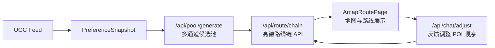

# AIroute 当前架构

本文描述 `codex/product-rag-amap-demo` 分支当前真实链路，不把计划项写成已完成项。

## 主链路



## 后端

```text
backend/app
  api/routes_pool.py              候选池 API
  api/routes_route.py             高德 route chain API
  api/routes_agent.py             Agent run/stream API
  repositories/poi_repo.py        seed + SQLite POI 聚合仓库
  repositories/sqlite_poi_repo.py app_pois + poi_feature_index + ugc_evidence_index loader
  repositories/faiss_index.py     FAISS 向量索引读取
  repositories/faiss_meta.py      FAISS JSONL sidecar metadata
  repositories/rag_build.py       poi_profile + ugc_review 文档构建
  services/retrieval_service.py   FAISS 召回聚合与 evidence/provenance 输出
  services/pool_service.py        语义召回 + SQLite FTS/bucket + 规则兜底融合
  services/solver_service.py      greedy 行程求解
  services/route_validator.py     intent-driven 餐饮/体验约束校验
  services/amap/                  高德 Web Service client/cache
  agent/                          Conductor、tool、memory 相关模块
  observability/                  logging、metrics、tracing 基础设施
```

## 检索与候选池

- POI 主数据来自可用的 SQLite 文件和 `load_seed_pois()`；成品验收以真实 `hefei_pois.sqlite` 为准，seed fallback 只作为降级。
- 可选 FAISS RAG 使用同一索引目录下的 `index.faiss` + `meta.jsonl`，文档类型是 `poi_profile` 和 `ugc_review`。
- `RetrievalService` 按 `poi_id` 聚合召回结果，输出 `semantic_poi_profile` / `semantic_ugc_review` provenance 和 top evidence。
- `PoolService` 融合 semantic POI、semantic UGC、SQLite FTS/bucket、seed fallback，并把 evidence/provenance/distance 暴露给前端 pool 类型。
- 前端默认带合肥市中心出发点和半径，也允许在生成面板切换出发点；后端按 origin 做半径过滤和距离惩罚。

## 路线与距离

- `/api/route/chain` 已接高德 Web Service client；无 key 时返回配置错误，有缓存和 mock 测试覆盖。
- `solver/distance.py` 已优先尝试高德距离/耗时，失败或无 key 时降级到 haversine，并在 `Transport.source` 标记 `amap` 或 `fallback`。
- `solver_service.py` 当前仍是 greedy 求解；P2-1 优化器尚未实现。
- `route_replanner.py` 仍按当前 POI 列表重排/替换，没有“已完成站点锁定”概念；P2-3 尚未实现。

## 已知缺口

- 真实数据 smoke 已支持 `AIROUTE_REAL_DATA_DIR`；完整真实 embedding 模型全量构建仍依赖本机模型下载和数据文件。
- Agent memory 模块保留自 `origin/main`，但没有和统一 FAISS retrieval contract 做新的深度接入。
- Observability 基础模块和 `/health` 存在，但统一检索链路的完整 trace/metrics 还没补齐。
- Embedding cache 存在，检索结果级缓存还没实现。
- Quality gates / prompt regression 文件存在，但本 PR 没有新增 CI gate wiring。
