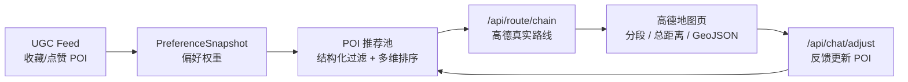

# AIroute 当前架构

本文只描述当前 Demo 真实使用的产品链路和代码结构。旧的多页行程创建、计划结果页、计划对比页已经从前端下线。

## 产品主线



核心边界：

- 大模型不直接生成路线，只负责理解需求、辅助推荐解释和反馈约束更新。
- POI 推荐由后端系统排序决定，高德只负责真实路线、距离、耗时和地图线。
- 用户提示词优先于历史点赞；UGC 偏好只作为软约束提高相似 POI 权重。
- 距离估算只作用于候选集，不对全量 POI 两两调用高德。

## 前端结构

```text
frontend/src
  App.tsx                         只暴露 UGC 首页与高德路线页
  pages/DiscoveryFeedPage.tsx     UGC Feed、偏好冷启动、POI 推荐入口
  pages/AmapRoutePage.tsx         高德路线结果与反馈调整
  components/AmapRouteMap.tsx     高德 JS 地图渲染
  store/preferenceStore.ts        收藏状态与偏好快照
  store/poolStore.ts              POI 推荐池请求
  store/amapRouteStore.ts         路线页请求上下文
  api/pool.ts                     推荐池 API
  api/route.ts                    高德路线链 API
  api/chat.ts                     反馈调整 API
  types/route.ts                  高德路线响应类型
```

已删除的前端冗余：

- `TripHomePage`、`TripCreatePage`、`TripDetailPage`
- `RecommendPoolPage`、`PlanResultPage`
- `planStore`、`tripStore`
- `PlanMap`、`PlanTimeline`、`PlanCompare`
- 旧 `/plan`、`/pool`、`/trips` 前端入口

## 后端结构

```text
backend/app
  api/routes_ugc.py               UGC Feed
  api/routes_preferences.py       偏好快照
  api/routes_pool.py              POI 推荐池
  api/routes_route.py             高德路线链
  api/routes_chat.py              反馈更新推荐 POI
  services/pool_service.py        召回、打分、排序、反馈调整
  services/amap/                  高德 Web Service client
  schemas/route.py                路线链请求与响应
  schemas/pool.py                 推荐池请求与响应
```

旧 `/api/plan/generate` 和 `/api/trips/*` 仍在后端保留兼容测试，但不再负责真实路线渲染，也不再从前端入口触发。

## 请求流

1. 前端调用 `GET /api/ugc/feed` 获取 UGC 卡片。
2. 用户收藏/取消收藏，`preferenceStore` 将 `liked_poi_ids` 持久化。
3. 点击“现在出发”时调用 `POST /api/preferences/snapshot` 生成偏好权重。
4. 调用 `POST /api/pool/generate` 得到有序 POI 和备选 POI。
5. 前端取推荐 POI 顺序调用 `POST /api/route/chain`，由高德返回真实路线。
6. 用户输入反馈时调用 `POST /api/chat/adjust`，后端更新推荐 POI。
7. 前端用新的 POI 顺序重新调用 `POST /api/route/chain`。

## 推荐方法

当前 MVP 使用本地结构化 POI/UGC 数据和可解释打分。后续 POI 规模扩大时，建议演进为：

- 城市、营业时间、预算、类别、黑名单先做结构化过滤。
- POI 主档案和 UGC snippet 分别建向量索引，万级数据可先用本地 Chroma/Faiss 风格接口，后续迁移 pgvector。
- 召回 top 100-300 后再做多维排序：文本语义、UGC 偏好、POI 质量、价格、排队、类别覆盖、距离/绕路惩罚、时间窗可行性。
- 只对 top 候选做距离测量或路线估算，最终 3-5 个 POI 再调用高德真实路线。

## 验证范围

- 无高德 Key 时 `/api/route/chain` 返回清晰配置错误。
- mock 高德 client 时路线接口返回分段、总距离、总耗时和 GeoJSON。
- 推荐服务输出有序 POI，反馈调整能替换/重排推荐 POI。
- 前端保留 UGC 首页，旧 `/plan`、`/pool`、`/trips` 路由回到首页。
