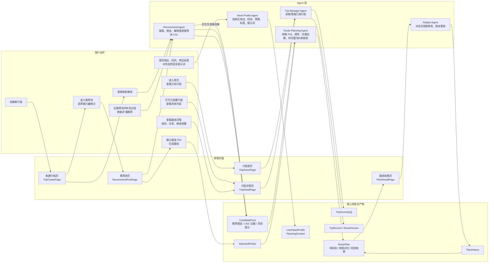
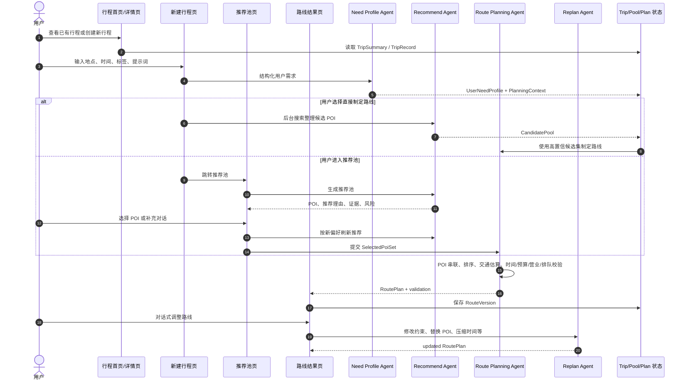
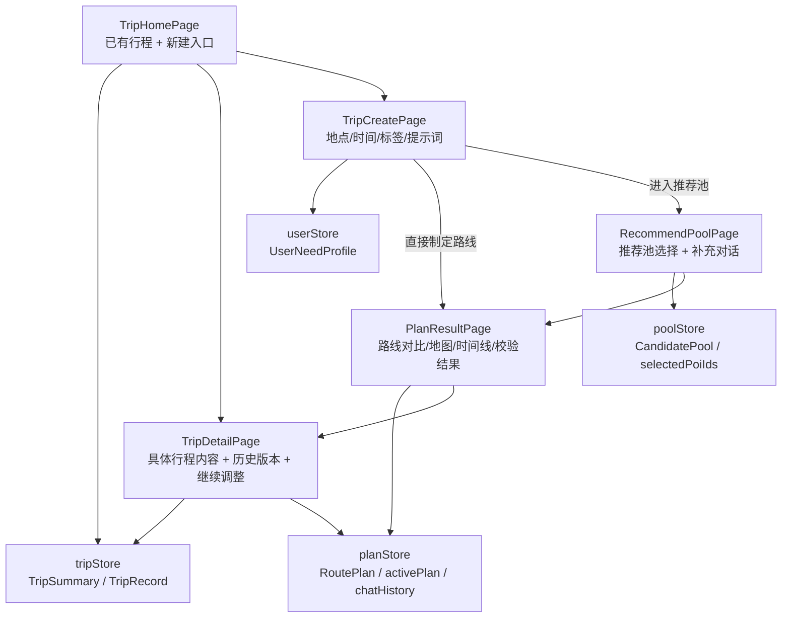
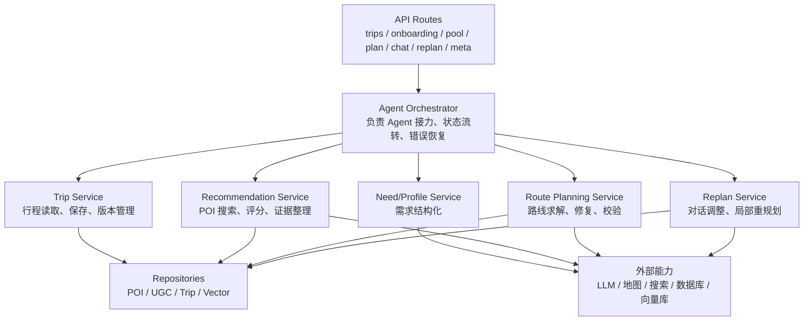

# AIroute 产品与 Agent 设计架构图

> 本文档以用户使用视角为主线，描述“行程首页 -> 新建需求 -> 推荐池 -> 路线制定 -> 行程详情/调整”的目标架构，并标注当前代码中已经落地或可复用的模块。

## 1. 用户旅程与 Agent 泳道

## 2. 核心流程

## 3. Agent 职责边界

| Agent | 触发位置 | 输入 | 核心职责 | 输出 |
| --- | --- | --- | --- | --- |
| Trip Manager Agent | 行程首页、行程详情页 | 用户 ID、trip_id | 读取已有行程、管理行程版本、提供历史上下文 | TripSummary、TripRecord、RouteVersion |
| Need Profile Agent | 新建行程页 | 地点、时间、特征标签、自然语言提示词 | 抽取并补齐结构化需求，判断是否足够规划 | UserNeedProfile、PlanningContext |
| Recommend Agent | 推荐池页，或直接制定路线的后台步骤 | UserNeedProfile、PlanningContext、补充对话 | 搜索整理值得推荐的 POI，给出推荐理由、UGC 证据、风险提示，并支持对话刷新 | CandidatePool |
| Route Planning Agent | 用户确认 POI 后，或直接制定路线分支 | CandidatePool、SelectedPoiSet、PlanningContext | 串联 POI、安排顺序、估算交通、控制时间窗和预算，核心目标是路线合理可执行 | RoutePlan、ValidationResult |
| Replan Agent | 路线结果页、行程详情页 | RoutePlan、用户调整消息、事件 | 局部重规划，替换 POI、压缩行程、处理天气/预算/排队等变化 | updated RoutePlan、PlanHistory |

## 4. 页面与状态设计

## 5. 后端服务分层

## 6. 与当前代码的映射

| 目标架构模块 | 当前已有基础 | 后续需要补齐 |
| --- | --- | --- |
| 行程首页 / 行程详情 | 当前有 `PlanPage` 展示路线结果 | 新增 TripHomePage、TripDetailPage、tripStore、行程持久化 |
| 新建行程页 | 当前 `HomePage` 已有地点、时间、标签、提示词输入 | 拆成更明确的新建流程，并支持“直接制定路线 / 进入推荐池”两个出口 |
| Need Profile Agent | `OnboardingService`、`routes_onboarding.py` | 增强槽位追问、用户画像记忆、与行程上下文绑定 |
| Recommend Agent | `PoolService`、`PoiScoringService`、`VectorRepository`、`routes_pool.py` | 从本地 seed 扩展到搜索/地图/UGC 数据源，支持推荐池对话刷新 |
| Route Planning Agent | `PlanService`、`SolverService`、`RouteRepairer`、`RouteValidator` | 强化交通估算、营业时间、地理顺路性、多目标优化和失败恢复 |
| Replan Agent | `ChatService`、`RouteReplanner`、`routes_chat.py`、`routes_replan.py` | 绑定行程版本，支持更细粒度的局部修改和用户确认 |
| 状态与持久化 | 当前后端使用内存 registry，前端使用 Zustand | 引入 Trip/Plan 持久化，替换仅进程内保存的 registry |

## 7. 当前落地与预留边界

| 能力 | 当前状态 |
| --- | --- |
| 前端主流程 | 已落地需求输入、推荐池选择、路线结果与聊天调整；需要新增首页/详情页形成完整行程产品闭环 |
| 推荐池 | 已能基于本地 POI/UGC 生成候选池；目标上由 Recommend Agent 负责搜索、整理、解释和对话刷新 |
| 路线制定 | 已能生成三种风格路线并做基础校验；目标上 Route Planning Agent 专注路线合理性，包括顺路、时间窗、交通和约束 |
| 对话调整 | 已支持简单意图识别和局部重规划；目标上成为行程版本管理的一部分 |
| 数据源 | 当前主链路使用本地 seed POI/UGC；后续可接地图、搜索、真实 UGC、向量库 |
| 状态管理 | 当前后端使用内存 registry，前端使用 Zustand；后续需要 Trip/Plan 持久化 |
| LLM | 支持 OpenAI-compatible 接口；无 API key 时走确定性 fallback |
| PostgreSQL / Chroma / 高德地图 | Docker、路径和 key 已预留；当前主链路尚未完全接入 |

## 8. 主要依据文件

- `frontend/src/App.tsx`
- `frontend/src/pages/HomePage.tsx`
- `frontend/src/pages/PoolPage.tsx`
- `frontend/src/pages/PlanPage.tsx`
- `frontend/src/store/userStore.ts`
- `frontend/src/store/poolStore.ts`
- `frontend/src/store/planStore.ts`
- `backend/app/main.py`
- `backend/app/api/*.py`
- `backend/app/services/*.py`
- `backend/app/repositories/*.py`
- `backend/app/llm/client.py`
- `docker-compose.yml`
