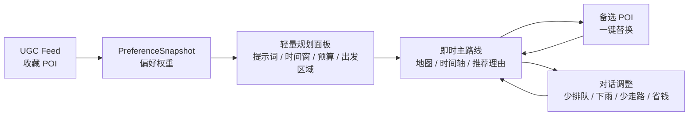

# AIroute 当前架构

本文档只保留当前 Demo 真实使用的产品链路和代码结构。旧版“多日旅行规划”“三条完整路线对比”“独立推荐池页面”的说明已移除。

## 产品主线



核心原则：

- 用户输入提示词优先，时间、预算、必去、避开项、少排队等硬约束先过滤。
- UGC 收藏偏好作为软约束，只提高相似 POI 的评分，不强行覆盖用户当前需求。
- 收藏 POI 合理时可进入主路线；太远、排队过久或违反时间窗时进入备选区并说明原因。
- 默认展示一条可执行主路线，同时给出可替换 POI，降低即时场景下的选择负担。

## 前端结构

```text
frontend/src
  App.tsx                         路由入口
  api/client.ts                   后端 API 封装
  pages/DiscoveryFeedPage.tsx     首屏 UGC Feed 与规划入口
  pages/PlanResultPage.tsx        主路线、备选 POI、对话调整
  pages/TripsPage.tsx             已保存行程列表
  pages/TripDetailPage.tsx        行程详情
  store/preferenceStore.ts        收藏状态与偏好快照
  store/planStore.ts              当前路线、备选、聊天记录
  store/tripStore.ts              行程管理状态
  types/api.ts                    前后端共享响应类型
```

首屏不再进入旧的多步骤规划页，而是先通过 UGC Feed 让用户形成可解释的偏好数据。生成路线时，前端会把 `preference_snapshot` 一起传给候选池和路线规划接口。

## 后端结构

```text
backend/app
  main.py                         FastAPI app 与路由注册
  api/routes_ugc.py               UGC Feed
  api/routes_preferences.py       偏好快照
  api/routes_pool.py              候选 POI 召回
  api/routes_plan.py              主路线生成
  api/routes_chat.py              对话调整与替换动作
  api/routes_meta.py              城市、persona 等元数据
  repositories/poi_repository.py  本地 seed POI/UGC 数据访问
  schemas/*.py                    请求、响应、路线、偏好类型
  services/preference_service.py  偏好权重计算
  services/pool_service.py        候选召回与评分
  services/plan_service.py        规划编排
  services/chat_service.py        动态调整
  services/solver_service.py      路线求解
  services/validator.py           路线约束校验
```

已删除旧版未使用模块：

- 旧首页、旧候选池页、旧规划页：`HomePage.tsx`, `PoolPage.tsx`, `PlanPage.tsx`
- 旧独立重规划接口：`routes_replan.py`
- 未接入的 SQLAlchemy model 包
- 未使用的 profile service
- 过期方案文档和旧架构图片

## 请求流

1. 前端调用 `GET /api/ugc/feed` 获取本地 UGC 卡片。
2. 用户收藏/取消收藏，`preferenceStore` 将 `liked_poi_ids` 持久化到 localStorage。
3. 规划前调用 `POST /api/preferences/snapshot`，得到 `tag_weights`、`category_weights`、`keyword_weights`。
4. 调用 `POST /api/pool/generate`，候选 POI 的 `ScoreBreakdown.history_preference` 体现历史偏好贡献。
5. 调用 `POST /api/plan/generate`，得到 `RefinedPlan` 和 `alternative_pois`。
6. 用户点击备选 POI 时，前端调用 `POST /api/chat/adjust`，传入 `action_type="replace_stop"`、`target_stop_index`、`replacement_poi_id`。
7. 用户输入自然语言调整时，仍由 `POST /api/chat/adjust` 处理，并返回新的可执行路线。

## 规划约束

主路线必须满足：

- 至少 3 个 POI。
- 至少 1 个餐饮类 POI。
- 至少 1 个文化、娱乐或景点类 POI。
- 总时长不超过用户时间窗。
- 推荐理由能追溯到用户输入、收藏偏好、POI 属性、UGC 证据或评分项。

## 验证范围

后端重点覆盖：

- 偏好快照计算。
- 历史偏好评分加权。
- 用户提示词与历史偏好冲突时提示词优先。
- 收藏 POI 合理进入主路线，不合理进入备选。
- 路线约束校验。
- 备选 POI 替换后仍通过 Validator。

前端重点覆盖：

- UGC 收藏/取消收藏状态。
- 偏好持久化。
- 生成路线时携带 `preference_snapshot`。
- 结果页展示主路线和备选 POI。
